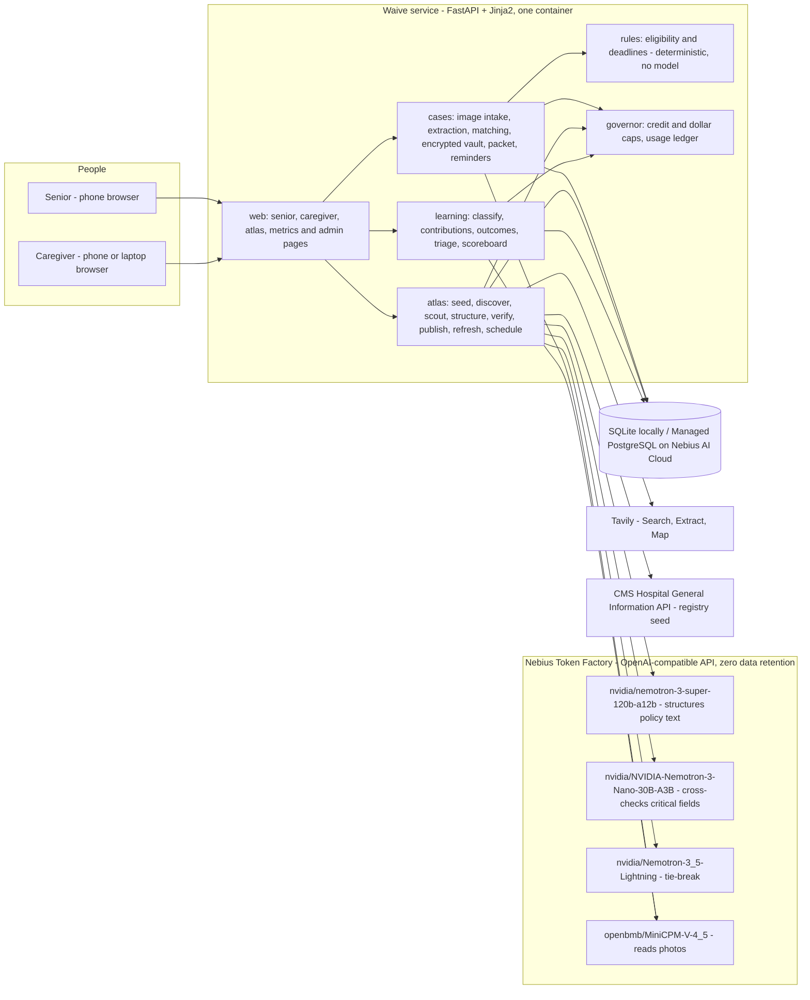
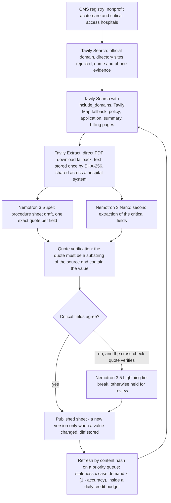

# Waive

Free or discounted hospital care you are owed, from a photo of the bill.

Waive is a phone-browser app for low-income seniors and the family members who help them. The senior photographs a hospital bill; Waive reads it, checks it against that hospital's own financial assistance policy, says in plain words whether the bill is likely free or discounted, and prepares the application packet for a caregiver to approve, print and mail. Behind the app is an open, cited **atlas** of hospital *procedure sheets* — who qualifies and exactly how to apply, one sheet per hospital, every fact backed by an exact quote from a dated source — built and refreshed by Tavily scouts and NVIDIA Nemotron models on Nebius Token Factory.

Built for the Nebius x NVIDIA Global AI Hackathon (Personal AI track), October 2026, by a solo builder working with Claude Code.

- Demo video (under 3 minutes): [USER FILLS: YouTube URL after gate U8.2]
- Devpost project: [USER FILLS: Devpost URL after gate U8.3]
- Screenshots: `docs/devpost/gallery/` holds 12 captures of the senior flow, the caregiver review and the atlas pages, captioned in [`docs/devpost/gallery/README.md`](docs/devpost/gallery/README.md), the two architecture diagrams from this file, and the caregiver's packet for the demo case, [`packet-sample.pdf`](docs/devpost/gallery/packet-sample.pdf).
- **Deployment status (update this line when Phase 6 task 6.8 closes):** not deployed yet — the Dockerfile and the `WAIVE_ENV=production` settings target a Nebius AI Cloud Serverless AI endpoint with Managed PostgreSQL; until then, run Waive locally with the steps below. *(Replacement text once live: "Live at `https://…` on Nebius AI Cloud (CPU Serverless AI endpoint + Managed PostgreSQL); the endpoint runs during judging windows only.")*

Waive never asks for money, card numbers or bank logins. Results are estimates, not legal advice; the hospital makes the final decision.

## What it does

**For the senior (phone, no account, no typing).** A caregiver sends a link. The senior taps *Take a photo of the bill*; Waive reads the hospital, the amount and the statement date with a vision model and reads them back in large print (*Yes, that's right* / *Something is wrong*). Two big-button questions follow (household size; MassHealth or SNAP), then a photo of the Social Security benefit letter instead of typing an income. The result is one sentence — "Good news. You likely do not have to pay this bill." — with a *Read this to me* button.

**For the caregiver (phone or laptop).** A review page shows what was read, the result with the exact policy quote it rests on, the dates that matter (day 120: no collection actions before it; day 240: end of the application window; both count from the first bill after discharge, so the caregiver can enter that date when a later statement was photographed), and corrections for anything misread. *Approve* produces the packet: a cover letter citing the policy section, the application data sheet, the document checklist and the hospital's mailing or fax instructions, plus calendar reminders (`.ics`). One tap deletes the case and every personal field derived from it.

**The atlas.** For each nonprofit acute-care or critical-access hospital in the CMS registry, Tavily finds the official website and scouts the financial assistance policy, application, plain-language summary and billing/collections policy; Nemotron 3 Super turns the documents into a procedure sheet draft; Nemotron 3 Nano extracts the critical fields a second time; every field is kept only if its quote is a verbatim substring of the cited source and contains the value. Sheets are versioned, published as open data (CC BY 4.0) and shown at `/atlas` with quotes, sources and dates. A scheduler refreshes documents by content hash inside a daily credit budget.

**The learning loop.** Photos of hospital letters become outcomes; an outcome that contradicts a sheet triggers a re-scout, a new sheet version after review, and — after enough cases — an accountability flag for hospitals that deny people their own policy says qualify. Patients' photos of public documents fill gaps after an automated personal-information check and admin review. Only enums, income bands and one-way hashes are stored from outcomes.

## Status, honestly (2026-10-09)

| Area | Where it stands |
|---|---|
| Massachusetts atlas | 46 nonprofit acute-care and critical-access hospitals in the registry; **27 published sheets (59 %)**, 17 held (no income rules in the reachable text, discount tiers the schema cannot parse, an unresolved cross-model conflict, or stored pages that turned out not to be the hospital's policy: a moved site's navigation menu, a billing directory's pages about other hospitals), 2 with no documents found. Every published documented field passed exact-quote verification, re-run under the current rules on 2026-10-09: `waive atlas recheck --withdraw` cut 27 sheets' document, channel and program lists to the items their quotes name and withdrew asset-test and insured-patient values whose quotes said nothing of the kind (no model call). All 44 sheets (published and held) carry a cited Massachusetts Health Safety Net entry from mass.gov. Report: `docs/reports/atlas-ma.md` |
| National registry | **2,703** nonprofit hospitals seeded from CMS for all 50 states and DC; 134 published nationally (5 %), core fields documented on 59 % of published sheets, 545 open review items. Scouting of CA, NY, TX, FL, PA, IL, OH and NJ started 2026-10-09 on a 300-credit daily budget (about 5 Tavily credits per hospital; 981 hospitals queued); the first batch was rebuilt the same day from its stored documents after the yield fixes (6 hospitals published through a sibling's system policy, 7 withdrawn to held: four wrong sites, a misread ceiling, two tables the schema cannot hold); the review of that rebuild cost $0.21 more: 13 hospitals rebuilt again from stored documents, 18 re-verified in place, and 5 moved to held (four where two of the hospital's own documents name different free-care limits, three of them against a 2021 AdventHealth flyer that still says 200 %; one whose only discount table was quoted as a range). The second batch (2026-10-10, 1,000 credits a day at the advanced extraction depth) scouted 140 hospitals for 943 credits: 84 published, 40 held, 16 without usable documents; three of the 84 were withdrawn the same day because discovery had matched another hospital's website (a same-named hospital in another state), and 14 more hospitals that landed on price directories or unrelated sites were queued for a fresh scout. A place check added the same day holds any sheet whose documents never name the hospital's state, or name neither its town nor the hospital (hand-confirmed sites excepted): it withdrew six more published sheets, among them MetroWest Medical Center in Massachusetts, which had stood published from another health system's policy since 2026-10-03. State exports: `data/atlas/`. Report: `docs/reports/atlas-national.md` |
| Bill reading | 30 synthetic bills (several layouts, rotations, blur): hospital name 100 %, statement date 97 %, amount due 100 %, FAP phone 100 %, FAP web address 100 %, collection notice 100 %. Report: `docs/reports/bill-eval.md` |
| Real bills | Accepted since 2026-10-09: the Token Factory project runs with zero data retention, confirmed that day by the project owner (`WAIVE_ZDR_CONFIRMED=true`). None processed yet; everything so far ran on synthetic bills and letters. Waive still refuses photos carrying personal data whenever `WAIVE_ZDR_CONFIRMED` is false |
| Learning loop | Implemented and exercised end to end by a simulation test (three denials → re-scout → new version after review → open cases re-evaluated; a missing document appears as "reported by patients" after 5 cases; a hospital slip is flagged after 3). No real outcomes yet |
| Deployment | See the status line at the top |
| Spend to date | 1,642 Tavily credits, $4.61 on Token Factory, $0 on AI Cloud (2026-10-10) |
| Tests | 300+ unit, contract and simulation tests; none opens a network socket |

The demo hospital, **St. Example Medical Center** (CCN 229999), is fictional and is excluded from exports, reports and the public atlas list (`/atlas?demo=1` shows it).

## Architecture



One deployable Python service with an in-process scheduler; a CLI (`waive …`) exposes the same pipelines for batch runs. Pure, unit-tested domain logic (eligibility, deadlines, quote verification) sits under thin adapters for the model API, Tavily and the database.

How a procedure sheet is built:



| Package | Responsibility |
|---|---|
| `waive.config` | Typed settings from `.env` (`WAIVE_*`), secrets as `SecretStr`, the production guard |
| `waive.ai` | Token Factory client (OpenAI SDK), JSON-schema outputs with one repair retry, `enable_thinking` off for Nemotron, PHI flag and the zero-data-retention check, cost per call |
| `waive.governor` | Hard caps for Tavily credits and Token Factory dollars, a usage ledger (`var/usage.jsonl` or the `usage_events` table), daily credit budget |
| `waive.rules` | 2026 poverty guidelines, eligibility tiers, 120/240-day deadlines, plain-language and caregiver messages with citations |
| `waive.atlas` | Registry seed, domain discovery, scouting, structuring, quote verification, cross-check and tie-break, publishing with versions, state overlays, refresh, scheduler, metrics |
| `waive.cases` | Image intake (orientation, resize, metadata strip, blur check), bill and letter extraction, hospital matching, AES-GCM vault, scoped capability links, packet PDF, `.ics` reminders, synthetic corpus |
| `waive.learning` | Photo classifier, document contributions with a personal-information check, outcome capture, triage, evidence thresholds, scoreboard |
| `waive.web` | Senior, caregiver, public atlas, metrics and admin pages (server-rendered, plain CSS, ≥ 20 px text, ≥ 48 px targets) |
| `waive.cli` | `doctor`, `atlas …`, `corpus …`, `eval …`, `db …`, `demo …`, `learn …`, `serve` |

## How Nebius, NVIDIA and Tavily are used at runtime

**Nebius Token Factory** is the only model API Waive calls: `src/waive/ai/client.py` points the OpenAI SDK at `https://api.tokenfactory.nebius.com/v1/` with `NEBIUS_API_KEY`. Every call goes through the spend governor and the zero-data-retention check.

| Runtime step | Model on Token Factory | Role in `Settings` | Code |
|---|---|---|---|
| Turn a hospital's policy documents into a procedure sheet draft with an exact quote per field | `nvidia/nemotron-3-super-120b-a12b` (NVIDIA Nemotron 3 Super, 262K context) | `model_reason` | `src/waive/atlas/structure.py`, `src/waive/atlas/pipeline.py` |
| Extract the critical fields a second time; a disagreement counts only when the cross-check's own quote verifies | `nvidia/NVIDIA-Nemotron-3-Nano-30B-A3B` (NVIDIA Nemotron 3 Nano) | `model_fast` | `src/waive/atlas/pipeline.py`, `src/waive/atlas/publish.py` |
| Third opinion when Super and Nano disagree on a critical field | `nvidia/Nemotron-3_5-Lightning` (NVIDIA Nemotron 3.5 Lightning) | `model_tiebreak` | `src/waive/atlas/pipeline.py`, `src/waive/atlas/publish.py` |
| Read bill photos and Social Security letters; classify photos of hospital papers; read decision letters | `openbmb/MiniCPM-V-4_5` — **not an NVIDIA model**; see the note below | `model_vision` | `src/waive/cases/extract.py`, `src/waive/learning/classify.py`, `src/waive/learning/outcomes.py` |
| Quote verification, hospital matching, eligibility, deadlines, packet | no model — deterministic Python | — | `src/waive/atlas/verify.py`, `src/waive/cases/match.py`, `src/waive/rules/` |

**NVIDIA open models.** The three Nemotron models above run at runtime whenever a sheet is built, cross-checked or tie-broken (`waive atlas build`, `waive atlas refresh`, the scheduler, `waive learn rebuild`). On the vision side there is **no NVIDIA vision model** in the Token Factory catalog (checked live on 2026-10-02 with `waive doctor --live`), so photos are read by `openbmb/MiniCPM-V-4_5`; `google/gemma-3-27b-it` was verified as an alternative on 2026-10-02 and can be selected with the same setting. The role is one setting (`WAIVE_MODEL_VISION`), and we would switch to a Nemotron vision model the day Token Factory offers one.

**Nebius AI Cloud.** The `Dockerfile` builds a two-stage, non-root image that runs `uvicorn waive.web.app:create_app --factory` on port 8000; `WAIVE_ENV=production` refuses the SQLite default and `WAIVE_LEDGER_BACKEND=db` keeps the spend ledger in PostgreSQL so a stateless container keeps its budget history. The deployment plan (`docs/superpowers/plans/2026-10-02-waive-phase-6-deploy.md`) uses Container Registry, Managed PostgreSQL, SecretStash for the six secrets and a CPU Serverless AI endpoint, and adds a `waive cloud start|stop|status|cleanup` command group (Phase 6 task 6.7, not written yet) so the endpoint only bills during demo windows. Current state: see the deployment status line at the top.

**Tavily** does all of the web work in the atlas (`src/waive/atlas/tavily_gateway.py` wraps `tavily-python`; every call books credits with the governor first):

| Step | Tavily API | Code |
|---|---|---|
| Find the hospital's official website; reject directory sites; confirm by name tokens, phone and page title | Search | `src/waive/atlas/discover.py` |
| Find the policy, application, plain-language summary and billing/collections pages on that domain; follow labelled policy links; fall back to Map when the search index misses them | Search with `include_domains`, Map | `src/waive/atlas/scout.py` |
| Fetch page and PDF text; store it once by SHA-256 and share it across a hospital system; re-extract pages that render as navigation only at the advanced depth; download PDFs and pages directly when Extract returns nothing usable | Extract (+ `httpx` + `pypdf` fallback) | `src/waive/atlas/scout.py`, `src/waive/atlas/fetch.py` |
| Add a cited state program (Massachusetts Health Safety Net) from mass.gov to every sheet in the state | Search, Extract | `src/waive/atlas/overlays.py` |
| Re-check stored documents by content hash and re-structure only what changed | Extract | `src/waive/atlas/refresh.py` |
| Scout unattended on a priority queue inside a daily credit budget (`WAIVE_SCOUT_DAILY_CREDITS`) | the calls above | `src/waive/atlas/schedule.py` |

Measured cost: about 5 credits per hospital (two searches, often a Map, one or two Extracts), two more when a page renders as navigation only and needs the advanced extraction depth; the scheduler starts a hospital only with 7 credits left in the day. With `WAIVE_SCOUT_EXTRACT_DEPTH=advanced` every page is rendered at the advanced depth on the first pass (never twice): about 9 credits per hospital, in exchange for fuller policy text to quote from. The Massachusetts atlas took 438 credits including every debugging re-run and the 2026-10-09 re-scouts; the national batches run at the advanced depth on a 1,000-credit daily budget since 2026-10-10.

## Setup

Requirements: macOS or Linux, Python 3.12 via `uv`, a Nebius Token Factory key and a Tavily key (both free to create; the app runs without them, but then no photo is read and no sheet is built).

```bash
brew install uv                 # or: curl -LsSf https://astral.sh/uv/install.sh | sh
uv python install 3.12
uv sync
cp .env.example .env            # add NEBIUS_API_KEY and TAVILY_API_KEY; never commit .env
uv run waive keygen             # paste the two printed lines into .env (vault key, link secret)
uv run waive doctor             # offline checks; add --live to call both APIs (1 Tavily credit)
uv run waive demo reset         # the fictional St. Example Medical Center, its policy and the demo bill
uv run waive serve              # http://localhost:8000
```

`waive demo reset` writes the demo bill `var/demo/bill.jpg` (an $1,850 statement from St. Example to the fictional Rosa Alvarez), its ground truth `var/demo/bill.json` and a Social Security benefit letter `var/demo/letter.jpg`; it also deletes every case in the local database and puts the demo hospital back to version 1, so it is the command to run before each demo. `var/` is not committed. For more bills in other layouts, `uv run waive corpus generate --count 3` writes `var/corpus/bill-000.jpg` and onwards.

On a phone on the same Wi-Fi, open `http://<your computer's IP>:8000` (`ipconfig getifaddr en0` on a Mac), tap *Start a case*, open the senior link and photograph `var/demo/bill.jpg` shown on the laptop screen, then `var/demo/letter.jpg` when asked for the Social Security letter. The web flow treats photos as personal data and sends them to the model because the Token Factory project runs with zero data retention (confirmed 2026-10-09 by the project owner; `WAIVE_ZDR_CONFIRMED=true` in `.env`). On a machine where `WAIVE_ZDR_CONFIRMED` is false, Waive refuses the photos (`ZDRRequired`); set it to `true` only once zero data retention is confirmed for your own Token Factory project.

Build the atlas for a state (spends credits — about 5 Tavily credits and one cent of Token Factory per hospital):

```bash
uv run waive atlas seed --state MA         # free: CMS datastore API
uv run waive atlas build --state MA --limit 5
uv run waive atlas overlay --state MA      # cited Health Safety Net entry, about 2 credits
uv run waive atlas export --state MA       # data/atlas/ma.json, CC BY 4.0
uv run waive atlas report --state MA       # docs/reports/atlas-ma.md
```

The admin console (`/admin/login`) switches on when `WAIVE_ADMIN_TOKEN` (16+ characters) is set. The production container is built with `docker build -t waive:dev .`.

## Commands

| Command | What it does | Paid? |
|---|---|---|
| `waive doctor [--live]` | Configuration and connectivity checks without printing secrets; `--live` calls both APIs | 1 Tavily credit with `--live` |
| `waive keygen` | Fresh vault key and link secret for `.env` | no |
| `waive serve [--host] [--port]` | Run the web app | no |
| `waive atlas seed --state XX \| --all-states` | Load nonprofit acute-care and critical-access hospitals from CMS | no |
| `waive atlas build --state XX [--limit N] [--ccn X] [--rebuild] [--reuse-sources] [--no-dual]` | Discover, scout, structure, verify and publish sheets (`--reuse-sources` re-structures from stored documents without Tavily) | yes |
| `waive atlas overlay --state XX` | Add cited state programs to every sheet in the state | yes |
| `waive atlas refresh --ccn X \| --state XX [--limit N]` | Re-fetch stored documents; re-structure only the hospitals whose documents changed | yes |
| `waive atlas schedule [--dry-run\|--run] [--limit N] [--state XX] [--top N]` | Show the scouting priority queue and today's budget; `--run` spends credits | with `--run` |
| `waive atlas export --state XX [--out PATH]` | Write the latest sheets as open data | no |
| `waive atlas report --state XX \| --national [--out PATH]` | Coverage report in Markdown | no |
| `waive atlas recheck [--state XX] [--all] [--withdraw]` | List latest sheets whose stored fields the current verification rules reject (run after a rule change); `--withdraw` republishes them without those fields, no model call | no |
| `waive corpus generate [--count N] [--out DIR] [--seed N]` | Fictional bill images with ground truth | no |
| `waive eval bills [--corpus DIR] [--limit N] [--out PATH]` | Per-field extraction accuracy on the corpus | yes (vision) |
| `waive db upgrade` | Create missing tables and columns | no |
| `waive demo seed` | Add the fictional St. Example hospital | no |
| `waive demo reset [--out DIR] [--keep-files]` | Delete every case, put the demo hospital back to version 1 and rewrite `bill.jpg`, `bill.json` and `letter.jpg` in `var/demo/` (`--out` elsewhere; `--keep-files` leaves the images alone) | no |
| `waive demo gallery [--out DIR] [--chrome PATH] [--live] [--port N] [--atlas-ccn X] [--diagrams/--no-diagrams]` | Photograph the demo flow and the atlas pages with headless Chrome and export this file's diagrams through kroki.io into `docs/devpost/gallery/`; creates one demo case, so run `demo reset` afterwards | only with `--live` (the vision model reads the two demo images, about $0.01) |
| `waive demo forget-cases` | Delete every case (all personal data) | no |
| `waive learn rebuild --ccn X` | Re-structure one sheet from stored documents and approved patient photos | yes (Token Factory) |
| `waive learn publish-reported --state XX` | Publish patient-reported fields that reached the 5-case threshold | no |
| `waive learn scoreboard [--state XX] [--queue]` | Per-hospital prediction accuracy; `--queue` opens priority re-checks | no |
| `waive learn audit` | Check that the learning tables hold only enums, dates, counts and hashes | no |

## Privacy and zero data retention

- **Zero data retention first.** The Token Factory project runs with zero data retention, confirmed 2026-10-09 by the project owner (`WAIVE_ZDR_CONFIRMED=true`), so real bills are now accepted. The guard stays on: `WAIVE_REQUIRE_ZDR=true` (default) makes every model call flagged as carrying personal data (`phi=True`: bill photos, benefit letters, hospital letters) raise `ZDRRequired` whenever `WAIVE_ZDR_CONFIRMED` is false, so a fresh deployment refuses personal data until its operator confirms zero data retention for its own project. Policy documents and synthetic test images are not personal data and run regardless.
- **Photos are never written to disk.** They are normalised in memory (orientation, ≤ 2000 px, metadata stripped) and discarded after extraction.
- **Personal fields are encrypted at rest** with AES-GCM (`WAIVE_VAULT_KEY`); the database holds a sealed blob per case plus de-identified prediction and outcome summaries.
- **Links, not logins.** Signed, expiring, revocable capability links with separate scopes: the senior's link can add photos and see the result; the caregiver's link can review, correct, approve and delete. A tampered token gets a plain "This link is not valid" page.
- **One-tap delete** removes the case and every personal field derived from it. De-identified evidence (enums, income bands, one-way case hashes) remains; `waive learn audit` checks that nothing else is there.
- **Logs never carry personal content**: a redacting filter drops records that look like amounts, account numbers or e-mail addresses (and strips tracebacks that do), and uvicorn runs with the access log off, both under `waive serve` and in the production container (`--no-access-log`), because tokens travel in URLs.
- **Web pages, PDFs and model output are data, never instructions.** The structurer has no tools, its output is schema-validated, and quote verification rejects any value that is not in the source.
- **No money ever.** Every page says: Waive never asks for money, card numbers or bank logins. Results are estimates; the hospital decides.

## Costs

Actual spend to date (from the usage ledger, `uv run waive doctor` prints the totals): **1,642 Tavily credits, $4.61 Token Factory, $0 AI Cloud** as of 2026-10-10.

| Model (Token Factory) | Input $/M tokens | Output $/M tokens |
|---|---|---|
| `nvidia/nemotron-3-super-120b-a12b` | 0.30 | 0.90 |
| `nvidia/NVIDIA-Nemotron-3-Nano-30B-A3B` | 0.06 | 0.24 |
| `nvidia/Nemotron-3_5-Lightning` | 0.06 | 0.24 |
| `openbmb/MiniCPM-V-4_5` | 0.658 | 1.11 |

Prices read from the Token Factory catalog on 2026-10-02 and kept in `PRICES_PER_MILLION` in `src/waive/ai/client.py`; unknown models are priced high on purpose so spend is never under-counted.

- **Per hospital:** about 5 Tavily credits to discover and scout, about one cent of Token Factory per structuring pass (Super + Nano; a tie-break adds a fraction). Re-structuring from stored documents (`--reuse-sources`) costs no credits.
- **Per case:** two photos (bill and letter) cost about a tenth of a cent each on the vision model; eligibility, deadlines and the packet are free.
- **Nebius AI Cloud (list prices read 2026-10-02, nothing provisioned yet):** CPU Serverless AI endpoint `cpu-d3 2vcpu-8gb` ≈ $0.066/h; Managed PostgreSQL `2vcpu-8gb` + 32 GiB ≈ $0.143/h; together ≈ $0.21/h while running. The endpoint is stopped between demo windows.
- **Hard caps** enforced by the governor before every paid call: `WAIVE_TAVILY_CREDIT_CAP` (1,000), `WAIVE_TOKEN_FACTORY_USD_CAP` (15), and a per-day scouting budget `WAIVE_SCOUT_DAILY_CREDITS` (50).

## Tests

```bash
uv run ruff format . && uv run ruff check . && uv run pytest
```

Unit tests for the rules (including a Hypothesis property test of the poverty-guideline arithmetic), schema and quote verification, contract tests for Token Factory and Tavily against recorded responses (`respx`), a synthetic bill corpus with a per-field accuracy report, a simulation of the whole learning loop, and web tests through FastAPI's test client. `pytest-socket` makes any test that opens a network socket fail. Live tests are marked `live` and excluded by default.

The same checks run in GitHub Actions (`.github/workflows/ci.yml`) on every push and pull request, with no secrets; the tests themselves cannot open a network socket. Dependabot (`.github/dependabot.yml`) opens weekly update pull requests for `uv.lock` and the workflow's actions. To report a vulnerability, see `SECURITY.md`.

## Project layout

```
src/waive/
  ai/          Token Factory client, prices, JSON repair
  atlas/       registry, discover, scout, fetch, structure, verify, publish, overlays, refresh, schedule, metrics,
               pipeline, repo, schema, samples, tavily_gateway
  cases/       images, extract, match, vault, service, packet, reminders, synth, evaluate
  learning/    classify, intake, contributions, outcomes, triage, evidence, gaps, hashing, scoreboard
  rules/       fpl, eligibility, deadlines, explain
  web/         app factory, routes, templates, static CSS
  cli.py       the `waive` command
  demo.py      the fictional demo hospital; `demo reset`: delete every case, re-seed it, write the demo images
  gallery.py   `demo gallery`: scripted demo case, headless Chrome screenshots, README diagrams via kroki.io
data/atlas/    open-data exports (CC BY 4.0) · data/seed/  dated CMS snapshots
docs/          design spec, phase plans, reports; docs/devpost/  submission text, demo script, checklist, gallery
var/           not committed: SQLite database, usage ledger, var/demo/ (bill.jpg, bill.json, letter.jpg), var/corpus/
tests/unit/    everything runs offline
.github/       CI workflow (ruff + pytest on every push and pull request) and Dependabot
.claude/skills/ nebius-starter skill vendored from antongisli/nebius-starter-skill (MIT; THIRD_PARTY_NOTICES.md)
```

## Licenses

- **Code:** Apache License 2.0 (SPDX `Apache-2.0`, as declared in `pyproject.toml`) — see `LICENSE`. Copyright 2026 [USER FILLS: copyright holder].
- **Vendored skill:** `.claude/skills/nebius-starter` comes from [antongisli/nebius-starter-skill](https://github.com/antongisli/nebius-starter-skill) under the MIT License — see `THIRD_PARTY_NOTICES.md` for the full text and attribution.
- **Atlas data** (`data/atlas/*.json`, `/atlas/{ccn}.json`, the reports under `docs/reports/`): Creative Commons Attribution 4.0 International (CC BY 4.0) — see `data/atlas/LICENSE.md`. Suggested attribution: "Waive atlas, CC BY 4.0, https://github.com/Fluffy-SHIBAINU/waive". The quoted policy text belongs to the hospitals that published it and is reproduced as short citations with source links.
- Hospital registry rows come from the CMS Hospital General Information dataset (public domain); poverty guidelines from HHS/ASPE (2026); the Massachusetts Health Safety Net entry from mass.gov.

## Acknowledgements and disclaimer

Dollar For keeps the largest known hand-built database of hospital charity-care rules and helps patients apply with human advocates; Waive is built to hand complex cases to people like them. Waive gives estimates based on each hospital's published policy; it is not legal or financial advice, it never submits anything on anyone's behalf, and the hospital makes every decision.
