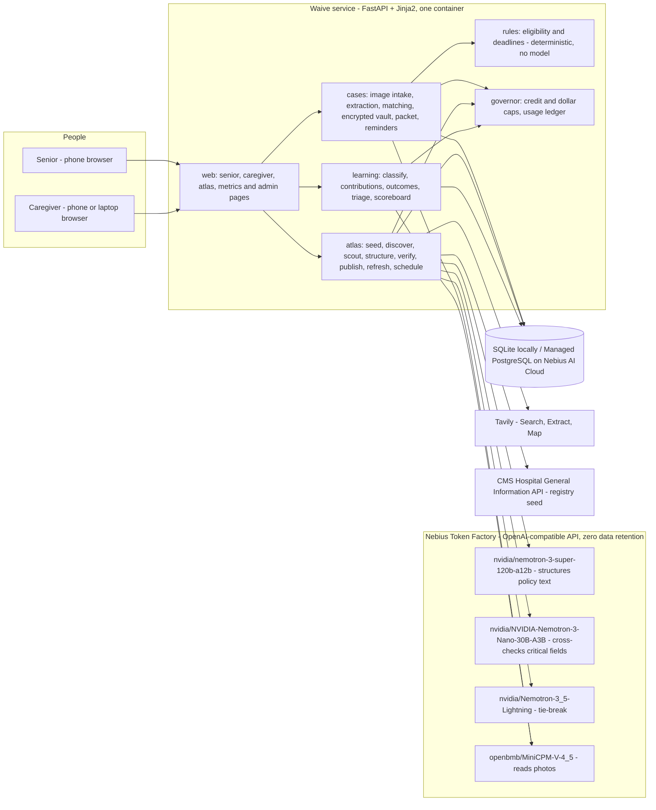
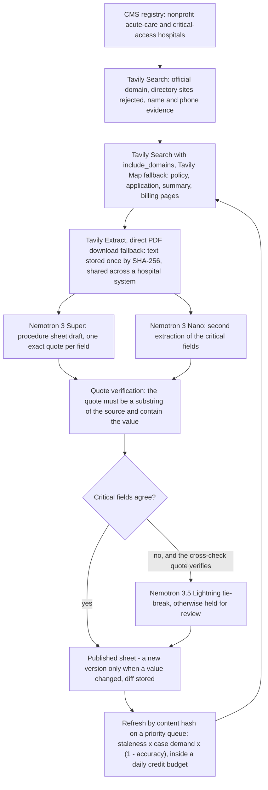

# Waive Phase 8 — Submission Implementation Plan

> **For agentic workers:** REQUIRED SUB-SKILL: Use superpowers:subagent-driven-development (recommended) or superpowers:executing-plans to implement this plan task-by-task. Steps use checkbox (`- [ ]`) syntax for tracking. One task per loop iteration (`docs/LOOP.md`); state lives in `docs/PROGRESS.md`, which implementation subagents never edit.

**Goal:** Everything Devpost needs for the Nebius x NVIDIA Global AI Hackathon (Personal AI track), ready by 2026-10-28, two days before the 2026-10-30 10:00 PT deadline: an honest README with setup, architecture diagram, runtime use of Nebius, NVIDIA and Tavily, privacy and costs; a repeatable demo (`waive demo reset`); a demo script timed to the second for a video under three minutes; the Devpost text including the required feedback on Nebius and NVIDIA tools and a "Best Use of Tavily" paragraph; gallery screenshots and diagrams captured by a script; and a pre-submission checklist that maps every Devpost requirement to evidence in the repo and spells out gates U8.1–U8.4.

**Architecture:** No new product surface. Two small additions to the existing `waive.demo` module and CLI: `waive demo reset` (puts the local database and the demo images back to the demo script's starting point without touching real hospitals) and `waive demo gallery` (drives one demo case through the app in-process with scripted extraction output, serves the app on a local port, and lets the Chrome already installed on the Mac take phone- and laptop-sized screenshots; README diagrams are exported through kroki.io). Everything else in the phase is prose: `README.md`, `data/atlas/LICENSE.md`, `docs/devpost/demo-script.md`, `docs/devpost/submission.md`, `docs/devpost/checklist.md`, `docs/devpost/gallery/`. Tests keep the prose honest: the README must name the configured model IDs and both licenses, the demo script's shot list must add up to under three minutes, and the Devpost draft must have every required section and no "TBD".

**Tech Stack:** Python 3.12 (uv), Typer, FastAPI + uvicorn (served in a thread for the gallery), httpx + respx, Pillow (synthetic letter), pytest with pytest-socket (no network in unit tests), headless Google Chrome (already at `/Applications/Google Chrome.app`, no new Python dependency), kroki.io for Mermaid → PNG (plain HTTP POST of public diagram text), QuickTime Player and iMovie (macOS, free) for the video.

**Spec:** `docs/superpowers/specs/2026-10-02-waive-design.md` (§1 summary, §3 G5 hackathon requirements, §11 privacy, §15 costs, §18 open items: licenses). Master plan Phase 8 section: `docs/superpowers/plans/2026-10-02-waive-master-plan.md`. Status, gates and spend: `docs/PROGRESS.md` (read-only for subagents). Reports quoted by the README: `docs/reports/atlas-ma.md`, `docs/reports/atlas-national.md`, `docs/reports/bill-eval.md`.

## Global Constraints

Copied from the master plan; every task in this phase obeys them.

- Python `>=3.12,<3.13`; managed by `uv`; package `waive` in `src/waive/`.
- Token Factory base URL `https://api.tokenfactory.nebius.com/v1/`; key in `NEBIUS_API_KEY`; Tavily key in `TAVILY_API_KEY`; AI Cloud project in `NEBIUS_PROJECT_ID`. All in `.env` only (gitignored).
- Models (verified live 2026-10-02): reason `nvidia/nemotron-3-super-120b-a12b`, fast `nvidia/NVIDIA-Nemotron-3-Nano-30B-A3B`, tie-break `nvidia/Nemotron-3_5-Lightning`, vision `openbmb/MiniCPM-V-4_5` (Token Factory offers no NVIDIA vision model; the NVIDIA requirement is met by Nemotron doing structuring, cross-checks and reasoning). Fallback vision: `google/gemma-3-27b-it`.
- Personal data is processed only after `WAIVE_ZDR_CONFIRMED=true`; before that, synthetic fixtures only.
- Development caps (spec §15): Tavily 1,000 credits, Token Factory $15, AI Cloud $30. Raising a cap needs the user's approval.
- No cloud resource creation, change or deletion, no push to a remote, and nothing made public without the user's explicit approval in chat.
- Senior screens: base text ≥ 20px, tap targets ≥ 48px, one action per screen, plain language, "likely" wording; the app never asks for money, card numbers or bank logins.
- Every documented atlas field carries an exact quote and a source; quote verification must pass before a sheet is published.
- Licenses: Apache-2.0 for code; CC BY 4.0 for atlas data.

Phase-specific:

- **No paid calls in tasks 8.1–8.6 as written.** Nothing in this plan runs `waive atlas build`, `waive atlas overlay`, `waive atlas schedule --run`, `waive atlas refresh` or `waive eval bills`. `waive demo gallery` uses scripted extraction output by default; its optional `--live` flag calls the vision model (about $0.01) and is never run by the loop. The only paid activity in the phase is the user's own video recording (gate U8.2: a handful of vision calls, about $0.01, and `waive doctor --live` if shown, 1 Tavily credit). Phase budget: Token Factory ≤ $0.50, Tavily ≤ 5 credits, AI Cloud: whatever Phase 6 already runs, nothing new.
- **Honest statements only.** Numbers in the README, the Devpost draft and the demo script come from the committed reports and `docs/PROGRESS.md` as of 2026-10-03: 46 Massachusetts hospitals in the registry, **27 published (59%)**, 17 held, 2 without documents; **2,703** nonprofit hospitals in the national registry, 27 published nationally (1%), core fields documented 67%, 115 open review items; bill reading on 30 synthetic bills: hospital name 100%, statement date 97%, amount due 100%, FAP phone 100%, FAP web address 100%, collection notice 100%; spend 389 Tavily credits, $1.52 Token Factory, $0 AI Cloud; 283 tests. The vision model is not an NVIDIA model and every document says so. Deployment (Phase 6) may still be pending when these documents are written: each document carries one clearly marked status line to update when task 6.8 closes, and reads correctly either way. When a later task changes a number (for example U2.2 approves more credits and more MA hospitals publish), the orchestrator refreshes the numbers in README.md and `docs/devpost/submission.md` in the same iteration.
- **User-decided fields.** Anything only the user can supply is written as `[USER FILLS: what]` — the GitHub repository URL, the YouTube URL, the Devpost project URL, the copyright holder's name, the live URL if deployed. Nothing is written as "TBD"; everything the plan can decide, it decides (see Decisions below). Task 8.6 verifies with `grep -rn "USER FILLS" README.md docs/devpost` that no field is left before the user submits.
- **Secrets.** Never print or copy `.env` values. The gallery capture writes HTML files that contain capability tokens of a throwaway demo case; the script deletes them after Chrome has read them, and the PNGs show page content only (headless screenshots have no address bar).
- **No network in unit tests** (`--disable-socket`): the gallery module is tested with FastAPI's `TestClient`, a fake `subprocess.run` and `respx`; headless Chrome and the threaded server are exercised only by the orchestrator's manual run step.
- **GateGuard.** A PreToolUse hook may deny the first Write/Edit of a file and the first Bash call with "Fact-Forcing Gate". Answer its questions in one short paragraph (callers, no duplicate file, data shape, the user's instruction) and retry the same call once. Prefer the Write tool over Bash heredocs for multi-line files.
- **Python `>=3.12,<3.13`, uv, ruff.** Every task ends with `uv run ruff format . && uv run ruff check . && uv run pytest` green. **283 tests pass at the start of the phase** (`uv run pytest --co` → "283 tests collected" on 2026-10-03); each task states its expected count (approximate — an implementer may add a test). `docs/` is excluded from ruff on purpose (`extend-exclude = ["docs"]`).
- **Interfaces relied on (verified against the code on 2026-10-03):** `config.Settings` (prefix `WAIVE_`, `_env_file=None` in tests; fields `model_reason`, `model_fast`, `model_tiebreak`, `model_vision`, `database_url`, `require_zdr`, `zdr_confirmed`, `nebius_api_key`); `db.make_engine / init_db / session_scope`, rows `HospitalRow`, `SourceDocRow`, `SheetRow(ccn, version, status, body, diff)`, `ReviewItemRow(ccn, kind, detail, status)`, `CaseRow(id, state, ccn, status, token_generation, sealed, prediction, outcome)`, `ContributionRow(ccn, case_hash, photo_class, sha256, text, reject_reasons, status, created_on)`, `ReportedEvidenceRow(ccn, field_path, value, case_hash, created_on)`, association table `hospital_sources(ccn, source_id)`; `atlas.repo.DEMO_CCNS == frozenset({"229999"})`, `is_demo`, `upsert_hospital`, `latest_sheet(session, ccn) -> (ProcedureSheet, SheetRow) | None`, `sheet_versions(session, ccn)`, `add_review_item(session, ccn, kind, detail)`, `open_review_items(session, ccn=None)`; `atlas.publish.publish_sheet(session, sheet)`; `atlas.samples.st_example_sheet()` (CCN 229999, "St. Example Medical Center", Boston, phone 617-555-0100, domain `example.org`, free care ≤ 250% FPL, 60% discount to 400%, 240-day window, 120-day collections wait); `demo.seed_demo(session)`, `demo.forget_cases(session) -> int`; `cases.synth.BillTruth(hospital_name, hospital_phone, fap_phone, fap_url, statement_date, account_reference, patient_name, amount_due, collection_notice)`, `render_bill(truth, rng, layout, rotate_deg, blur) -> bytes` (1700×2200 JPEG), `_font(size)`; `cases.extract.BillExtract(hospital_name, hospital_phone, fap_phone, fap_url, statement_date, amount_due, confidence, …)`, `IncomeExtract(monthly_benefit)`; `cases.match.match_hospital(extract, hospitals) -> list[MatchCandidate]`, `is_confident(candidates)` (`CONFIDENT_SCORE = 75`, name 60 % of token-set ratio + 30 phone + 30 domain); `web.app.create_app(settings, *, engine, ai, cipher, signer, today_fn)`; routes `GET /`, `POST /cases` (form `state`), `GET /s/{token}`, `POST /s/{token}/bill` (file `photo`), `POST /s/{token}/confirm` (form `answer`), `GET|POST /s/{token}/household` (form `size`, `programs`), `GET|POST /s/{token}/income` (file `photo` or form `skip`), `GET /s/{token}/result`, `GET /c/{token}`, `POST /c/{token}/approve`, `GET /c/{token}/packet.pdf`, `GET /atlas`, `GET /atlas/{ccn}`, `GET /atlas/{ccn}.json`, `GET /metrics`, `GET /metrics.json`, `GET /healthz`; `cli.app`, `cli.demo_app`, `cli._engine(settings)`, `cli.console`; `ai.client.AIClient(settings, governor)`, `ZDRRequired`, `PRICES_PER_MILLION`; `governor.make_governor(settings, engine=None)`; tests reuse `tests/unit/test_web_app.py::make_client(ai=None)`, `tests/unit/test_web_senior.py::HOSPITAL`, `tests/unit/test_pipeline.py::REAL_HOSPITAL`, `tests/unit/test_metrics.py::sheet_for(hospital, status)`, and `typer.testing.CliRunner` as in `tests/unit/test_doctor.py`.

## What exists today (checked 2026-10-03) and what task 8.1 creates versus edits

| Path | Today | Task 8.1 |
|---|---|---|
| `README.md` | Exists: 405 bytes, 14 lines (title, one-liner, status, link to the spec, four setup steps). Referenced by `pyproject.toml` (`readme = "README.md"`) and copied into the Docker image | **Rewritten in full** (same path, so `pyproject.toml` and the `Dockerfile` keep working) |
| `LICENSE` | Exists: the canonical Apache License 2.0 text, 202 lines, 11,358 bytes, including the standard appendix with the literal `Copyright [yyyy] [name of copyright owner]` line — that appendix is part of the canonical text and is normally left as is | **Unchanged**; verified by a test (size and header). The copyright notice goes into the README's Licenses section with a `[USER FILLS: copyright holder]` field |
| `pyproject.toml` | `license = { text = "Apache-2.0" }` | Unchanged |
| `data/atlas/LICENSE.md` | Does not exist (`data/atlas/ma.json` is committed and carries `"license": "CC BY 4.0"` inside) | **Created** (the atlas data license note) |
| `docs/devpost/` | Does not exist | Created by 8.3–8.6 |
| `tests/unit/test_readme.py` | Does not exist | **Created** |

## Decisions made by this plan (the user should know)

1. **LICENSE stays byte-for-byte canonical.** The appendix placeholder is part of the official Apache-2.0 text; the copyright notice lives in the README. The user fills the holder's name there (`[USER FILLS: copyright holder]`); the year is 2026.
2. **Atlas data license = CC BY 4.0** as the spec's §18 default; the attribution text is "Waive atlas, CC BY 4.0, [repository URL]". The note is `data/atlas/LICENSE.md`; the JSON exports already carry the license string.
3. **The README says plainly that the vision model (`openbmb/MiniCPM-V-4_5`) is not an NVIDIA model** and why (Token Factory lists no NVIDIA vision model); the NVIDIA requirement is met by the three Nemotron models at runtime in the atlas pipeline.
4. **Deployment status is one marked line** in the README, the Devpost draft and the demo script, written for "not deployed yet" with the replacement text ready. The hackathon requires Token Factory *and/or* AI Cloud, so the submission is valid even if Phase 6 stays gated.
5. **`waive demo reset` deletes every case** (as `waive demo forget-cases` already does — cases are personal data) and only the demo hospital's learning rows and sheet versions; real hospitals' sheets, documents and review items are untouched. Demo images are regenerated under `var/demo/` (gitignored), so nothing synthetic-but-personal-looking is committed.
6. **The demo persona is the spec's Rosa**: one-person household, $1,900 a month from Social Security ($22,800 a year, 143 % of the 2026 guideline), an $1,850 bill dated 2026-09-03 from the fictional St. Example Medical Center, whose policy gives free care up to 250 % FPL — the result is "You likely do not have to pay this bill." The same numbers already drive the web tests.
7. **Gallery screenshots are captured with scripted extraction output** equal to the demo bill's ground truth, so the capture is free and repeatable; the video shows the live model. `--live` exists for anyone who wants real-model screenshots and costs about $0.01.
8. **Headless Chrome, not Playwright.** Chrome is already installed on the build Mac; Playwright would add a browser download and a dependency for a one-off task. If Chrome is missing, the command prints the shot list and exits 1; the orchestrator can then take the same pages with the Claude Browser pane.
9. **Diagrams are exported through kroki.io** (`POST https://kroki.io/mermaid/png`, body = the diagram text from the README). Only public diagram text leaves the machine. Fallback: paste the same text into https://mermaid.live and export PNG.
10. **Suggested repository name `waive`**; the user may choose another — every URL is a `[USER FILLS]` field.
11. **Recording toolchain:** QuickTime Player (iPhone mirrored over USB for the senior shots; "New Screen Recording" for the laptop), iMovie to cut, 1080p MP4, duration checked with `mdls -name kMDItemDurationSeconds`. No new software to install.
12. **Live demo and zero data retention.** The web flow sends photos with `phi=True`, so a recording with the real model needs either gate U0.4 closed or `WAIVE_REQUIRE_ZDR=false` set temporarily in `.env` for the recording session with synthetic images only — exactly the U4.1 arrangement. The demo script says so and says to set it back.

## File structure

| File | Responsibility | Task |
|---|---|---|
| `README.md` (rewrite) | Setup, architecture (Mermaid), runtime use of Nebius / NVIDIA / Tavily, status numbers, privacy, costs, commands, licenses | 8.1 |
| `data/atlas/LICENSE.md` (create) | CC BY 4.0 note and attribution text for the exports | 8.1 |
| `tests/unit/test_readme.py` (create) | README names the configured models and both licenses; LICENSE is canonical; data license note exists | 8.1 |
| `src/waive/cases/synth.py` (modify) | `render_benefit_letter` | 8.2 |
| `src/waive/demo.py` (modify) | `DEMO_DIR`, `DEMO_BILL`, `DEMO_MONTHLY_BENEFIT`, `DEMO_LETTER_DATE`, `write_demo_images`, `ResetReport`, `reset_demo` | 8.2 |
| `src/waive/cli.py` (modify) | `waive demo reset`, `waive demo gallery` | 8.2, 8.5 |
| `tests/unit/test_demo.py` (rewrite, keeps the existing test) | Demo data, reset, CLI | 8.2 |
| `docs/devpost/demo-script.md` (create) | Shot list timed to the second, narration, recording and upload steps | 8.3 |
| `docs/devpost/submission.md` (create) | Devpost text, feedback on Nebius and NVIDIA tools, Best Use of Tavily | 8.4 |
| `src/waive/gallery.py` (create) | `ScriptedAI`, `Shot`, `ShotPlan`, `plan_shots`, `find_chrome`, `chrome_command`, `html_target`, `capture`, `export_mermaid`, `serving`, `run_gallery`, `GalleryError` | 8.5 |
| `tests/unit/test_gallery.py` (create) | Shot planning on the TestClient, Chrome discovery and command, HTML base injection, capture with a fake runner, kroki export with respx | 8.5 |
| `docs/devpost/gallery/*.png`, `packet-sample.pdf`, `README.md` (create) | The gallery files and their captions | 8.5 |
| `docs/devpost/checklist.md` (create) | Devpost requirement → evidence table; gates U8.1–U8.4 with the exact steps; final dry run | 8.6 |
| `tests/unit/test_devpost_docs.py` (create) | Required sections, no "TBD", shot list arithmetic ≤ 175 s | 8.6 |

---

### Task 8.1: README, LICENSE check and atlas data license note

**Files:**
- Rewrite: `README.md`
- Create: `data/atlas/LICENSE.md`, `tests/unit/test_readme.py`
- Verify only: `LICENSE`

**Interfaces:**
- Consumes: `Settings` model defaults (the test ties the README to them), the committed reports.
- Produces: nothing in code. The README is the public face of the repo; the test keeps it honest when a model ID changes.

- [ ] **Step 1: Write the failing test**

`tests/unit/test_readme.py`:

```python
"""The README must stay honest about models and licenses (Phase 8.1)."""

from pathlib import Path

from waive.config import Settings

ROOT = Path(__file__).resolve().parents[2]


def readme() -> str:
    return (ROOT / "README.md").read_text(encoding="utf-8")


def test_readme_names_the_configured_models_and_is_honest_about_vision():
    text = readme()
    settings = Settings(_env_file=None)
    for model in (
        settings.model_reason,
        settings.model_fast,
        settings.model_tiebreak,
        settings.model_vision,
    ):
        assert f"`{model}`" in text, model
    # Token Factory offers no NVIDIA vision model; the README says so instead of implying it.
    assert "no NVIDIA vision model" in text


def test_readme_has_the_required_sections_and_no_placeholders():
    text = readme()
    for heading in (
        "## Setup",
        "## Architecture",
        "## How Nebius, NVIDIA and Tavily are used at runtime",
        "## Privacy and zero data retention",
        "## Costs",
        "## Licenses",
    ):
        assert heading in text, heading
    assert "```mermaid" in text
    assert "Apache-2.0" in text and "CC BY 4.0" in text
    assert "Deployment status" in text  # the one line to update when Phase 6 task 6.8 closes
    assert "TBD" not in text


def test_license_is_the_canonical_apache_2_text():
    raw = (ROOT / "LICENSE").read_bytes()
    assert len(raw) == 11358
    text = raw.decode("utf-8")
    assert text.lstrip().startswith("Apache License")
    assert "Version 2.0, January 2004" in text


def test_atlas_data_license_note_exists():
    note = (ROOT / "data" / "atlas" / "LICENSE.md").read_text(encoding="utf-8")
    assert "CC BY 4.0" in note
    assert "https://creativecommons.org/licenses/by/4.0/" in note
```

- [ ] **Step 2: Run it to make sure it fails**

Run: `uv run pytest tests/unit/test_readme.py -v`
Expected: `test_license_is_the_canonical_apache_2_text` PASSES (the file is already canonical); the other three FAIL (`no NVIDIA vision model` missing, no `## Architecture`, `data/atlas/LICENSE.md` missing).

- [ ] **Step 3: Write the README**

Replace `README.md` with the following. Keep every `[USER FILLS: …]` field verbatim until the user supplies the value; keep the "Deployment status" line as the single place that changes when task 6.8 closes. The Commands table already lists `waive demo reset` and `waive demo gallery`, which tasks 8.2 and 8.5 of this phase add; nothing else in the README describes code that does not exist.

````markdown
# Waive

Free or discounted hospital care you are owed, from a photo of the bill.

Waive is a phone-browser app for low-income seniors and the family members who help them. The senior photographs a hospital bill; Waive reads it, checks it against that hospital's own financial assistance policy, says in plain words whether the bill is likely free or discounted, and prepares the application packet for a caregiver to approve, print and mail. Behind the app is an open, cited **atlas** of hospital *procedure sheets* — who qualifies and exactly how to apply, one sheet per hospital, every fact backed by an exact quote from a dated source — built and refreshed by Tavily scouts and NVIDIA Nemotron models on Nebius Token Factory.

Built for the Nebius x NVIDIA Global AI Hackathon (Personal AI track), October 2026, by a solo builder working with Claude Code.

- Demo video (under 3 minutes): [USER FILLS: YouTube URL after gate U8.2]
- Devpost project: [USER FILLS: Devpost URL after gate U8.3]
- **Deployment status (update this line when Phase 6 task 6.8 closes):** not deployed yet — the Dockerfile and the `WAIVE_ENV=production` settings target a Nebius AI Cloud Serverless AI endpoint with Managed PostgreSQL; until then, run Waive locally with the steps below. *(Replacement text once live: "Live at `https://…` on Nebius AI Cloud (CPU Serverless AI endpoint + Managed PostgreSQL); the endpoint runs during judging windows only.")*

Waive never asks for money, card numbers or bank logins. Results are estimates, not legal advice; the hospital makes the final decision.

## What it does

**For the senior (phone, no account, no typing).** A caregiver sends a link. The senior taps *Take a photo of the bill*; Waive reads the hospital, the amount and the statement date with a vision model and reads them back in large print (*Yes, that's right* / *Something is wrong*). Two big-button questions follow (household size; MassHealth or SNAP), then a photo of the Social Security benefit letter instead of typing an income. The result is one sentence — "Good news. You likely do not have to pay this bill." — with a *Read this to me* button.

**For the caregiver (phone or laptop).** A review page shows what was read, the result with the exact policy quote it rests on, the dates that matter (day 120: no collection actions before it; day 240: end of the application window), and corrections for anything misread. *Approve* produces the packet: a cover letter citing the policy section, the application data sheet, the document checklist and the hospital's mailing or fax instructions, plus calendar reminders (`.ics`). One tap deletes the case and every personal field derived from it.

**The atlas.** For each nonprofit acute-care or critical-access hospital in the CMS registry, Tavily finds the official website and scouts the financial assistance policy, application, plain-language summary and billing/collections policy; Nemotron 3 Super turns the documents into a procedure sheet draft; Nemotron 3 Nano extracts the critical fields a second time; every field is kept only if its quote is a verbatim substring of the cited source and contains the value. Sheets are versioned, published as open data (CC BY 4.0) and shown at `/atlas` with quotes, sources and dates. A scheduler refreshes documents by content hash inside a daily credit budget.

**The learning loop.** Photos of hospital letters become outcomes; an outcome that contradicts a sheet triggers a re-scout, a new sheet version after review, and — after enough cases — an accountability flag for hospitals that deny people their own policy says qualify. Patients' photos of public documents fill gaps after an automated personal-information check and admin review. Only enums, income bands and one-way hashes are stored from outcomes.

## Status, honestly (2026-10-03)

| Area | Where it stands |
|---|---|
| Massachusetts atlas | 46 nonprofit acute-care and critical-access hospitals in the registry; **27 published sheets (59 %)**, 17 held (no income rules in the reachable text, discount tiers the schema cannot parse, or an unresolved cross-model conflict), 2 with no documents found. Every published documented field passed exact-quote verification. All 45 sheets carry a cited Massachusetts Health Safety Net entry from mass.gov. Report: `docs/reports/atlas-ma.md` |
| National registry | **2,703** nonprofit hospitals seeded from CMS for all 50 states and DC; 27 published nationally (1 %), core fields documented on 67 % of published sheets, 115 open review items. Scouting beyond Massachusetts waits for a credit-budget decision (about 5 Tavily credits per hospital). Report: `docs/reports/atlas-national.md` |
| Bill reading | 30 synthetic bills (several layouts, rotations, blur): hospital name 100 %, statement date 97 %, amount due 100 %, FAP phone 100 %, FAP web address 100 %, collection notice 100 %. Report: `docs/reports/bill-eval.md` |
| Real bills | None yet, by design: photos carrying personal data are refused until zero data retention is confirmed for the Token Factory project (`WAIVE_ZDR_CONFIRMED=true`). Everything so far ran on synthetic bills and letters |
| Learning loop | Implemented and exercised end to end by a simulation test (three denials → re-scout → new version after review → open cases re-evaluated; a missing document appears as "reported by patients" after 5 cases; a hospital slip is flagged after 3). No real outcomes yet |
| Deployment | See the status line at the top |
| Spend to date | 389 Tavily credits, $1.52 on Token Factory, $0 on AI Cloud |
| Tests | 280+ unit, contract and simulation tests; none opens a network socket |

The demo hospital, **St. Example Medical Center** (CCN 229999), is fictional and is excluded from exports, reports and the public atlas list (`/atlas?demo=1` shows it).

## Architecture



One deployable Python service with an in-process scheduler; a CLI (`waive …`) exposes the same pipelines for batch runs. Pure, unit-tested domain logic (eligibility, deadlines, quote verification) sits under thin adapters for the model API, Tavily and the database.

How a procedure sheet is built:



| Package | Responsibility |
|---|---|
| `waive.config` | Typed settings from `.env` (`WAIVE_*`), secrets as `SecretStr`, the production guard |
| `waive.ai` | Token Factory client (OpenAI SDK), JSON-schema outputs with one repair retry, `enable_thinking` off for Nemotron, PHI flag and the zero-data-retention check, cost per call |
| `waive.governor` | Hard caps for Tavily credits and Token Factory dollars, a usage ledger (`var/usage.jsonl` or the `usage_events` table), daily credit budget |
| `waive.rules` | 2026 poverty guidelines, eligibility tiers, 120/240-day deadlines, plain-language and caregiver messages with citations |
| `waive.atlas` | Registry seed, domain discovery, scouting, structuring, quote verification, cross-check and tie-break, publishing with versions, state overlays, refresh, scheduler, metrics |
| `waive.cases` | Image intake (orientation, resize, metadata strip, blur check), bill and letter extraction, hospital matching, AES-GCM vault, scoped capability links, packet PDF, `.ics` reminders, synthetic corpus |
| `waive.learning` | Photo classifier, document contributions with a personal-information check, outcome capture, triage, evidence thresholds, scoreboard |
| `waive.web` | Senior, caregiver, public atlas, metrics and admin pages (server-rendered, plain CSS, ≥ 20 px text, ≥ 48 px targets) |
| `waive.cli` | `doctor`, `atlas …`, `corpus …`, `eval …`, `db …`, `demo …`, `learn …`, `serve` |

## How Nebius, NVIDIA and Tavily are used at runtime

**Nebius Token Factory** is the only model API Waive calls: `src/waive/ai/client.py` points the OpenAI SDK at `https://api.tokenfactory.nebius.com/v1/` with `NEBIUS_API_KEY`. Every call goes through the spend governor and the zero-data-retention check.

| Runtime step | Model on Token Factory | Role in `Settings` | Code |
|---|---|---|---|
| Turn a hospital's policy documents into a procedure sheet draft with an exact quote per field | `nvidia/nemotron-3-super-120b-a12b` (NVIDIA Nemotron 3 Super, 262K context) | `model_reason` | `src/waive/atlas/structure.py`, `src/waive/atlas/pipeline.py` |
| Extract the critical fields a second time; a disagreement counts only when the cross-check's own quote verifies | `nvidia/NVIDIA-Nemotron-3-Nano-30B-A3B` (NVIDIA Nemotron 3 Nano) | `model_fast` | `src/waive/atlas/pipeline.py`, `src/waive/atlas/publish.py` |
| Third opinion when Super and Nano disagree on a critical field | `nvidia/Nemotron-3_5-Lightning` (NVIDIA Nemotron 3.5 Lightning) | `model_tiebreak` | `src/waive/atlas/pipeline.py`, `src/waive/atlas/publish.py` |
| Read bill photos and Social Security letters; classify photos of hospital papers; read decision letters | `openbmb/MiniCPM-V-4_5` — **not an NVIDIA model**; see the note below | `model_vision` | `src/waive/cases/extract.py`, `src/waive/learning/classify.py`, `src/waive/learning/outcomes.py` |
| Quote verification, hospital matching, eligibility, deadlines, packet | no model — deterministic Python | — | `src/waive/atlas/verify.py`, `src/waive/cases/match.py`, `src/waive/rules/` |

**NVIDIA open models.** The three Nemotron models above run at runtime whenever a sheet is built, cross-checked or tie-broken (`waive atlas build`, `waive atlas refresh`, the scheduler, `waive learn rebuild`). On the vision side there is **no NVIDIA vision model** in the Token Factory catalog (checked live on 2026-10-02 with `waive doctor --live`), so photos are read by `openbmb/MiniCPM-V-4_5` (fallback `google/gemma-3-27b-it`). We would switch to a Nemotron vision model the day Token Factory offers one; the role is one setting (`WAIVE_MODEL_VISION`).

**Nebius AI Cloud.** The `Dockerfile` builds a two-stage, non-root image that runs `uvicorn waive.web.app:create_app --factory` on port 8000; `WAIVE_ENV=production` refuses the SQLite default and `WAIVE_LEDGER_BACKEND=db` keeps the spend ledger in PostgreSQL so a stateless container keeps its budget history. The deployment plan (`docs/superpowers/plans/2026-10-02-waive-phase-6-deploy.md`) uses Container Registry, Managed PostgreSQL, SecretStash for the six secrets and a CPU Serverless AI endpoint, with `waive cloud start|stop` so the endpoint only bills during demo windows. Current state: see the deployment status line at the top.

**Tavily** does all of the web work in the atlas (`src/waive/atlas/tavily_gateway.py` wraps `tavily-python`; every call books credits with the governor first):

| Step | Tavily API | Code |
|---|---|---|
| Find the hospital's official website; reject directory sites; confirm by name tokens, phone and page title | Search | `src/waive/atlas/discover.py` |
| Find the policy, application, plain-language summary and billing/collections pages on that domain; follow labelled policy links; fall back to Map when the search index misses them | Search with `include_domains`, Map | `src/waive/atlas/scout.py` |
| Fetch page and PDF text; store it once by SHA-256 and share it across a hospital system; download PDFs directly when Extract returns nothing usable | Extract (+ `httpx` + `pypdf` fallback) | `src/waive/atlas/scout.py`, `src/waive/atlas/fetch.py` |
| Add a cited state program (Massachusetts Health Safety Net) from mass.gov to every sheet in the state | Search, Extract | `src/waive/atlas/overlays.py` |
| Re-check stored documents by content hash and re-structure only what changed | Extract | `src/waive/atlas/refresh.py` |
| Scout unattended on a priority queue inside a daily credit budget (`WAIVE_SCOUT_DAILY_CREDITS`) | the calls above | `src/waive/atlas/schedule.py` |

Measured cost: about 5 credits per hospital (two searches, often a Map, one or two Extracts). The 389 credits spent so far built the Massachusetts atlas including every debugging re-run.

## Setup

Requirements: macOS or Linux, Python 3.12 via `uv`, a Nebius Token Factory key and a Tavily key (both free to create; the app runs without them, but then no photo is read and no sheet is built).

```bash
brew install uv                 # or: curl -LsSf https://astral.sh/uv/install.sh | sh
uv python install 3.12
uv sync
cp .env.example .env            # add NEBIUS_API_KEY and TAVILY_API_KEY; never commit .env
uv run waive keygen             # paste the two printed lines into .env (vault key, link secret)
uv run waive doctor             # offline checks; add --live to call both APIs (1 Tavily credit)
uv run waive demo seed          # the fictional St. Example Medical Center and its policy
uv run waive serve              # http://localhost:8000
```

On a phone on the same Wi-Fi, open `http://<your computer's IP>:8000` (`ipconfig getifaddr en0` on a Mac), tap *Start a case*, open the senior link and photograph a synthetic bill from `uv run waive demo reset` (`var/demo/bill.jpg`) shown on the laptop screen. The web flow treats photos as personal data: until zero data retention is confirmed (`WAIVE_ZDR_CONFIRMED=true`), set `WAIVE_REQUIRE_ZDR=false` in `.env` for a synthetic-only session and set it back afterwards.

Build the atlas for a state (spends credits — about 5 Tavily credits and one cent of Token Factory per hospital):

```bash
uv run waive atlas seed --state MA         # free: CMS datastore API
uv run waive atlas build --state MA --limit 5
uv run waive atlas overlay --state MA      # cited Health Safety Net entry, about 2 credits
uv run waive atlas export --state MA       # data/atlas/ma.json, CC BY 4.0
uv run waive atlas report --state MA       # docs/reports/atlas-ma.md
```

The admin console (`/admin/login`) switches on when `WAIVE_ADMIN_TOKEN` (16+ characters) is set. The production container is built with `docker build -t waive:dev .`.

## Commands

| Command | What it does | Paid? |
|---|---|---|
| `waive doctor [--live]` | Configuration and connectivity checks without printing secrets; `--live` calls both APIs | 1 Tavily credit with `--live` |
| `waive keygen` | Fresh vault key and link secret for `.env` | no |
| `waive serve [--host] [--port]` | Run the web app | no |
| `waive atlas seed --state XX \| --all-states` | Load nonprofit acute-care and critical-access hospitals from CMS | no |
| `waive atlas build --state XX [--limit N] [--ccn X] [--rebuild] [--reuse-sources] [--no-dual]` | Discover, scout, structure, verify and publish sheets (`--reuse-sources` re-structures from stored documents without Tavily) | yes |
| `waive atlas overlay --state XX` | Add cited state programs to every sheet in the state | yes |
| `waive atlas refresh --ccn X \| --state XX [--limit N]` | Re-fetch stored documents; re-structure only the hospitals whose documents changed | yes |
| `waive atlas schedule [--dry-run\|--run] [--limit N] [--state XX] [--top N]` | Show the scouting priority queue and today's budget; `--run` spends credits | with `--run` |
| `waive atlas export --state XX [--out PATH]` | Write the latest sheets as open data | no |
| `waive atlas report --state XX \| --national [--out PATH]` | Coverage report in Markdown | no |
| `waive corpus generate [--count N] [--out DIR] [--seed N]` | Fictional bill images with ground truth | no |
| `waive eval bills [--corpus DIR] [--limit N] [--out PATH]` | Per-field extraction accuracy on the corpus | yes (vision) |
| `waive db upgrade` | Create missing tables and columns | no |
| `waive demo seed` | Add the fictional St. Example hospital | no |
| `waive demo reset [--out DIR] [--keep-files]` | Delete every case, reset the demo hospital, regenerate the demo images | no |
| `waive demo gallery [--out DIR] [--chrome PATH] [--live] [--port N]` | Screenshots and diagrams for the Devpost gallery | only with `--live` |
| `waive demo forget-cases` | Delete every case (all personal data) | no |
| `waive learn rebuild --ccn X` | Re-structure one sheet from stored documents and approved patient photos | yes (Token Factory) |
| `waive learn publish-reported --state XX` | Publish patient-reported fields that reached the 5-case threshold | no |
| `waive learn scoreboard [--state XX] [--queue]` | Per-hospital prediction accuracy; `--queue` opens priority re-checks | no |
| `waive learn audit` | Check that the learning tables hold only enums, dates, counts and hashes | no |

## Privacy and zero data retention

- **Zero data retention first.** `WAIVE_REQUIRE_ZDR=true` (default) makes every model call flagged as carrying personal data (`phi=True`: bill photos, benefit letters, hospital letters) raise `ZDRRequired` until an operator confirms that zero data retention is enabled for the Token Factory project and sets `WAIVE_ZDR_CONFIRMED=true`. Policy documents and synthetic test images are not personal data and run regardless.
- **Photos are never written to disk.** They are normalised in memory (orientation, ≤ 2000 px, metadata stripped) and discarded after extraction.
- **Personal fields are encrypted at rest** with AES-GCM (`WAIVE_VAULT_KEY`); the database holds a sealed blob per case plus de-identified prediction and outcome summaries.
- **Links, not logins.** Signed, expiring, revocable capability links with separate scopes: the senior's link can add photos and see the result; the caregiver's link can review, correct, approve and delete. A tampered token gets a plain "This link is not valid" page.
- **One-tap delete** removes the case and every personal field derived from it. De-identified evidence (enums, income bands, one-way case hashes) remains; `waive learn audit` checks that nothing else is there.
- **Logs never carry personal content**: a redacting filter drops records that look like amounts, account numbers or e-mail addresses, and the production container runs uvicorn with `--no-access-log` because tokens travel in URLs.
- **Web pages, PDFs and model output are data, never instructions.** The structurer has no tools, its output is schema-validated, and quote verification rejects any value that is not in the source.
- **No money ever.** Every page says: Waive never asks for money, card numbers or bank logins. Results are estimates; the hospital decides.

## Costs

Actual spend to date (from the usage ledger, `uv run waive doctor` prints the totals): **389 Tavily credits, $1.52 Token Factory, $0 AI Cloud**.

| Model (Token Factory) | Input $/M tokens | Output $/M tokens |
|---|---|---|
| `nvidia/nemotron-3-super-120b-a12b` | 0.30 | 0.90 |
| `nvidia/NVIDIA-Nemotron-3-Nano-30B-A3B` | 0.06 | 0.24 |
| `nvidia/Nemotron-3_5-Lightning` | 0.06 | 0.24 |
| `openbmb/MiniCPM-V-4_5` | 0.658 | 1.11 |

Prices read from the Token Factory catalog on 2026-10-02 and kept in `PRICES_PER_MILLION` in `src/waive/ai/client.py`; unknown models are priced high on purpose so spend is never under-counted.

- **Per hospital:** about 5 Tavily credits to discover and scout, about one cent of Token Factory per structuring pass (Super + Nano; a tie-break adds a fraction). Re-structuring from stored documents (`--reuse-sources`) costs no credits.
- **Per case:** two photos (bill and letter) cost about a tenth of a cent each on the vision model; eligibility, deadlines and the packet are free.
- **Nebius AI Cloud (list prices read 2026-10-02, nothing provisioned yet):** CPU Serverless AI endpoint `cpu-d3 2vcpu-8gb` ≈ $0.066/h; Managed PostgreSQL `2vcpu-8gb` + 32 GiB ≈ $0.143/h; together ≈ $0.21/h while running. The endpoint is stopped between demo windows.
- **Hard caps** enforced by the governor before every paid call: `WAIVE_TAVILY_CREDIT_CAP` (1,000), `WAIVE_TOKEN_FACTORY_USD_CAP` (15), and a per-day scouting budget `WAIVE_SCOUT_DAILY_CREDITS` (50).

## Tests

```bash
uv run ruff format . && uv run ruff check . && uv run pytest
```

Unit tests for the rules, schema and quote verification (property tests with Hypothesis), contract tests for Token Factory and Tavily against recorded responses (`respx`), a synthetic bill corpus with a per-field accuracy report, a simulation of the whole learning loop, and web tests through FastAPI's test client. `pytest-socket` makes any test that opens a network socket fail. Live tests are marked `live` and excluded by default.

## Project layout

```
src/waive/
  ai/          Token Factory client, prices, JSON repair
  atlas/       registry, discover, scout, fetch, structure, verify, publish, overlays, refresh, schedule, metrics
  cases/       images, extract, match, vault, service, packet, reminders, synth, evaluate
  learning/    classify, intake, contributions, outcomes, triage, evidence, scoreboard
  rules/       fpl, eligibility, deadlines, explain
  web/         app factory, routes, templates, static CSS
  cli.py       the `waive` command
  demo.py      demo hospital, reset, demo images
  gallery.py   screenshots and diagrams for the Devpost gallery
data/atlas/    open-data exports (CC BY 4.0) · data/seed/  dated CMS snapshots
docs/          design spec, phase plans, reports, Devpost material
tests/unit/    everything runs offline
```

## Licenses

- **Code:** Apache License 2.0 — see `LICENSE`. Copyright 2026 [USER FILLS: copyright holder].
- **Atlas data** (`data/atlas/*.json`, `/atlas/{ccn}.json`, the reports under `docs/reports/`): Creative Commons Attribution 4.0 International (CC BY 4.0) — see `data/atlas/LICENSE.md`. Suggested attribution: "Waive atlas, CC BY 4.0, [USER FILLS: repository URL]". The quoted policy text belongs to the hospitals that published it and is reproduced as short citations with source links.
- Hospital registry rows come from the CMS Hospital General Information dataset (public domain); poverty guidelines from HHS/ASPE (2026); the Massachusetts Health Safety Net entry from mass.gov.

## Acknowledgements and disclaimer

Dollar For keeps the largest known hand-checked database of hospital charity-care rules and helps patients apply with human advocates; Waive is built to hand complex cases to people like them. Waive gives estimates based on each hospital's published policy; it is not legal or financial advice, it never submits anything on anyone's behalf, and the hospital makes every decision.
````

- [ ] **Step 4: Write the atlas data license note**

`data/atlas/LICENSE.md`:

```markdown
# Waive atlas data — CC BY 4.0

The files in this folder (`*.json`, one per state) and the JSON served at `/atlas/{ccn}.json` are
Waive's open atlas of hospital financial-assistance procedure sheets. They are licensed under the
Creative Commons Attribution 4.0 International license:

https://creativecommons.org/licenses/by/4.0/

You may copy, share and adapt the data for any purpose, including commercially, as long as you
give credit. Suggested attribution:

> Waive atlas, CC BY 4.0, [USER FILLS: repository URL]

What the data is: for every hospital, each documented field carries the value, an exact quote
from the hospital's own document, the source document's URL, its SHA-256 and the date it was
fetched; reported fields carry a count of distinct cases instead of a quote. The quoted policy
text belongs to the hospital that published it and is reproduced as a short citation.

What the data is not: legal advice, or a promise that a hospital will decide a particular way.
Policies change; check `checked_on` and the source link, and tell the hospital what you found if
they disagree with their own document.

Sources: hospital websites (via Tavily), state repositories (mass.gov), the CMS Hospital General
Information dataset (public domain) for the registry rows. The fictional demo hospital
(CCN 229999) is never exported.
```

- [ ] **Step 5: Verify LICENSE without editing it**

Run: `wc -l -c LICENSE && head -3 LICENSE && grep -n "Copyright \[yyyy\]" LICENSE`
Expected: `202 11358 LICENSE`; the first lines read `Apache License` / `Version 2.0, January 2004` / `http://www.apache.org/licenses/`; line 190 is the appendix placeholder. Make no change.

- [ ] **Step 6: Run the tests, lint, format**

Run: `uv run ruff format . && uv run ruff check . && uv run pytest`
Expected: about 287 tests pass (283 + 4). `ruff` ignores `docs/` and does not touch Markdown.

Sanity-check the Mermaid blocks by eye: every label is in double quotes, no unquoted parentheses, each edge on its own line. GitHub renders both blocks; the plan's 8.5 export through kroki.io is the second check.

- [ ] **Step 7: Commit**

```bash
git add README.md data/atlas/LICENSE.md tests/unit/test_readme.py
git commit -m "docs: README with architecture, runtime use of Nebius/NVIDIA/Tavily, privacy, costs; atlas data license note (8.1)"
```

---

### Task 8.2: Demo data and `waive demo reset`

**Files:**
- Modify: `src/waive/cases/synth.py` (`render_benefit_letter`), `src/waive/demo.py`, `src/waive/cli.py`
- Rewrite: `tests/unit/test_demo.py` (keeps the existing `test_seed_and_forget`)

**Interfaces:**
- Consumes: `BillTruth`, `render_bill`, `_font`, `seed_demo`, `forget_cases`, `repo.DEMO_CCNS`, `repo.latest_sheet`, rows `SheetRow`, `ReviewItemRow`, `ContributionRow`, `ReportedEvidenceRow`, `hospital_sources`.
- Produces (`waive.cases.synth`): `render_benefit_letter(name: str, monthly: Decimal, letter_date: date) -> bytes` (1700×2200 JPEG, fictional Social Security benefit-verification letter).
- Produces (`waive.demo`): `DEMO_DIR = Path("var/demo")`; `DEMO_BILL: BillTruth`; `DEMO_MONTHLY_BENEFIT = Decimal("1900.00")`; `DEMO_LETTER_DATE = date(2026, 1, 10)`; `write_demo_images(out_dir: Path) -> list[Path]` (writes `bill.jpg`, `bill.json`, `letter.jpg`); `ResetReport(cases_deleted, review_items_deleted, contributions_deleted, evidence_deleted, sources_unlinked, sheet_versions_deleted, sheet_version, files)`; `reset_demo(session, out_dir=DEMO_DIR, *, write_files=True) -> ResetReport`.
- Produces (CLI): `waive demo reset [--out DIR] [--keep-files]`.

- [ ] **Step 1: Write the failing tests**

Replace `tests/unit/test_demo.py` with:

```python
import json
from datetime import date
from decimal import Decimal
from io import BytesIO

from PIL import Image
from typer.testing import CliRunner

from waive.atlas import repo
from waive.atlas.publish import publish_sheet
from waive.atlas.samples import st_example_sheet
from waive.cases.extract import BillExtract
from waive.cases.match import is_confident, match_hospital
from waive.cases.synth import render_benefit_letter
from waive.cli import app
from waive.db import (
    CaseRow,
    ContributionRow,
    ReportedEvidenceRow,
    SheetRow,
    init_db,
    make_engine,
    session_scope,
)
from waive.demo import (
    DEMO_BILL,
    DEMO_LETTER_DATE,
    DEMO_MONTHLY_BENEFIT,
    forget_cases,
    reset_demo,
    seed_demo,
    write_demo_images,
)

from tests.unit.test_metrics import sheet_for
from tests.unit.test_pipeline import REAL_HOSPITAL


def memory_engine():
    engine = make_engine("sqlite+pysqlite:///:memory:")
    init_db(engine)
    return engine


def test_seed_and_forget():
    engine = memory_engine()
    with session_scope(engine) as session:
        seed_demo(session)
        seed_demo(session)
        assert repo.latest_sheet(session, "229999")[0].version == 1
        session.add(CaseRow(id="x", state="MA", status="new", token_generation=1))
    with session_scope(engine) as session:
        assert forget_cases(session) == 1


def test_demo_bill_is_rosa_and_matches_the_demo_hospital_confidently():
    # Spec §2 persona: one person, $1,900 a month, an $1,850 bill — free care under St. Example's
    # 250% rule. The same figures drive the web tests, so the video and the tests agree.
    assert DEMO_BILL.patient_name == "Rosa Alvarez"
    assert DEMO_BILL.amount_due == Decimal("1850.00")
    assert DEMO_BILL.statement_date == date(2026, 9, 3)
    assert DEMO_MONTHLY_BENEFIT * 12 == Decimal("22800.00")
    assert DEMO_LETTER_DATE < DEMO_BILL.statement_date
    extract = BillExtract(
        hospital_name=DEMO_BILL.hospital_name,
        hospital_phone=DEMO_BILL.hospital_phone,
        fap_phone=DEMO_BILL.fap_phone,
        fap_url=DEMO_BILL.fap_url,
    )
    candidates = match_hospital(extract, [st_example_sheet().hospital])
    assert candidates[0].ccn == "229999" and is_confident(candidates)


def test_render_benefit_letter_is_a_full_size_jpeg():
    jpeg = render_benefit_letter("Rosa Alvarez", Decimal("1900.00"), date(2026, 1, 10))
    assert jpeg[:3] == b"\xff\xd8\xff"
    assert Image.open(BytesIO(jpeg)).size == (1700, 2200)
    # Deterministic: the demo images never change between runs.
    assert jpeg == render_benefit_letter("Rosa Alvarez", Decimal("1900.00"), date(2026, 1, 10))


def test_write_demo_images_writes_bill_truth_and_letter(tmp_path):
    files = write_demo_images(tmp_path / "demo")
    assert [path.name for path in files] == ["bill.jpg", "bill.json", "letter.jpg"]
    assert (tmp_path / "demo" / "bill.jpg").read_bytes()[:3] == b"\xff\xd8\xff"
    truth = json.loads((tmp_path / "demo" / "bill.json").read_text())
    assert truth["hospital_name"] == "St. Example Medical Center"
    assert truth["amount_due"] == "1850.00" and truth["collection_notice"] is False
    assert write_demo_images(tmp_path / "demo") == files  # idempotent


def test_reset_demo_clears_cases_and_demo_rows_but_keeps_real_hospitals(tmp_path):
    engine = memory_engine()
    with session_scope(engine) as session:
        seed_demo(session)
        repo.upsert_hospital(session, REAL_HOSPITAL)
        publish_sheet(session, sheet_for(REAL_HOSPITAL))
        # A second demo sheet version, a case, and learning rows for both hospitals.
        session.add(
            SheetRow(
                ccn="229999",
                version=2,
                status="published",
                body=st_example_sheet().model_dump(mode="json"),
            )
        )
        session.add(
            CaseRow(id="case1", state="MA", ccn="229999", status="evaluated", token_generation=1)
        )
        repo.add_review_item(session, "229999", "rescout_request", {"count": 1})
        repo.add_review_item(session, REAL_HOSPITAL["ccn"], "rescout_request", {"count": 1})
        session.add(
            ContributionRow(
                ccn="229999",
                case_hash="a" * 16,
                photo_class="fap",
                sha256="b" * 64,
                created_on=date(2026, 10, 1),
            )
        )
        session.add(
            ReportedEvidenceRow(
                ccn="229999",
                field_path="apply.documents_required",
                value="photo_id",
                case_hash="c" * 16,
                created_on=date(2026, 10, 1),
            )
        )
    with session_scope(engine) as session:
        report = reset_demo(session, tmp_path / "demo")
        assert (report.cases_deleted, report.review_items_deleted) == (1, 1)
        assert (report.contributions_deleted, report.evidence_deleted) == (1, 1)
        assert report.sheet_versions_deleted == 2
        assert report.sheet_version == 1
        assert [row.version for row in repo.sheet_versions(session, "229999")] == [1]
        assert repo.latest_sheet(session, REAL_HOSPITAL["ccn"])[0].version == 1
        assert len(repo.open_review_items(session, REAL_HOSPITAL["ccn"])) == 1
        assert repo.open_review_items(session, "229999") == []
        assert [path.name for path in report.files] == ["bill.jpg", "bill.json", "letter.jpg"]
    with session_scope(engine) as session:
        again = reset_demo(session, tmp_path / "demo", write_files=False)
        assert (again.cases_deleted, again.sheet_versions_deleted, again.files) == (0, 1, [])


def test_demo_reset_command_prints_a_summary(monkeypatch, tmp_path):
    monkeypatch.chdir(tmp_path)  # no .env here; the database URL comes from the environment
    monkeypatch.setenv("WAIVE_DATABASE_URL", f"sqlite:///{tmp_path / 'waive.db'}")
    result = CliRunner().invoke(app, ["demo", "reset", "--out", str(tmp_path / "demo")])
    assert result.exit_code == 0, result.output
    assert "Deleted 0 case(s)" in result.output and "version 1" in result.output
    assert (tmp_path / "demo" / "letter.jpg").exists()
```

- [ ] **Step 2: Run them to make sure they fail**

Run: `uv run pytest tests/unit/test_demo.py -v`
Expected: FAIL at import with `ImportError: cannot import name 'render_benefit_letter'`.

- [ ] **Step 3: Add the synthetic benefit letter**

Append to `src/waive/cases/synth.py` (after `render_bill`; `date`, `Decimal`, `Image`, `ImageDraw`, `io` are already imported there):

```python
def render_benefit_letter(name: str, monthly: Decimal, letter_date: date) -> bytes:
    """A fictional Social Security benefit-verification letter for demos and tests. Same page
    size as the bills so the phone flow's intake treats it the same way. Deterministic."""
    width, height = 1700, 2200
    image = Image.new("RGB", (width, height), "white")
    draw = ImageDraw.Draw(image)
    big, body = _font(52), _font(34)
    draw.text((100, 90), "Social Security Administration", fill="black", font=big)
    draw.text((100, 165), "Benefit Verification Letter", fill="black", font=body)
    draw.text((100, 215), f"Date: {letter_date.strftime('%B %d, %Y')}", fill="black", font=body)
    draw.text((100, 330), name, fill="black", font=body)
    paragraphs = [
        "You asked us for information from your record. The information that",
        "you requested is shown below. If you want anyone else to have this",
        "information, you may send them this letter.",
        "",
        "Information About Current Social Security Benefits",
        "",
        f"Your monthly Social Security benefit is ${monthly:,.2f}.",
        f"Monthly benefit amount: ${monthly:,.2f}",
        "",
        "Your benefit is paid on the third Wednesday of each month.",
        "",
        "This letter is for your records. It is not a bill. Do not send money.",
    ]
    y = 430
    for text in paragraphs:
        draw.text((100, y), text, fill="black", font=body)
        y += 60
    buffer = io.BytesIO()
    image.save(buffer, format="JPEG", quality=88)
    return buffer.getvalue()
```

- [ ] **Step 4: Add the demo data and the reset**

Replace `src/waive/demo.py` with:

```python
"""Fictional demo data so the app can be tried without keys or real hospitals, and a reset that
puts the local database and the demo images back to the demo script's starting point."""

import json
import random
from dataclasses import dataclass, field
from datetime import date
from decimal import Decimal
from pathlib import Path

from sqlalchemy import delete
from sqlalchemy.orm import Session

from waive.atlas import repo
from waive.atlas.publish import publish_sheet
from waive.atlas.samples import st_example_sheet
from waive.cases.synth import BillTruth, render_benefit_letter, render_bill
from waive.db import (
    CaseRow,
    ContributionRow,
    ReportedEvidenceRow,
    ReviewItemRow,
    SheetRow,
    hospital_sources,
)

DEMO_DIR = Path("var/demo")

# The spec's persona (§2): Rosa, 74, one-person household, $1,900 a month from Social Security,
# an $1,850 bill after an ER visit. St. Example gives free care up to 250% FPL, so the answer is
# "You likely do not have to pay this bill." Everything here is fictional.
DEMO_BILL = BillTruth(
    hospital_name="St. Example Medical Center",
    hospital_phone="617-555-0100",
    fap_phone="617-555-0100",
    fap_url="www.example.org/financial-assistance",
    statement_date=date(2026, 9, 3),
    account_reference="ACCT-20260903",
    patient_name="Rosa Alvarez",
    amount_due=Decimal("1850.00"),
    collection_notice=False,
)
DEMO_MONTHLY_BENEFIT = Decimal("1900.00")
DEMO_LETTER_DATE = date(2026, 1, 10)


def seed_demo(session: Session) -> None:
    sheet = st_example_sheet()
    h = sheet.hospital
    repo.upsert_hospital(
        session,
        {
            "ccn": h.ccn,
            "name": h.name.upper(),
            "address": "1 EXAMPLE WAY",
            "city": h.city.upper(),
            "state": h.state,
            "zip": h.zip,
            "phone": h.phone,
            "hospital_type": "Acute Care Hospitals",
            "ownership": h.ownership,
            "website_domain": h.website_domain,
        },
    )
    publish_sheet(session, sheet)


def forget_cases(session: Session) -> int:
    return session.execute(delete(CaseRow)).rowcount


def write_demo_images(out_dir: Path) -> list[Path]:
    """The demo bill (JPEG + ground truth) and the benefit letter. Deterministic, so re-running
    the reset never changes what the camera sees."""
    out_dir.mkdir(parents=True, exist_ok=True)
    bill = out_dir / "bill.jpg"
    bill.write_bytes(render_bill(DEMO_BILL, random.Random(2026), layout=0, rotate_deg=0.0, blur=0.0))
    truth = out_dir / "bill.json"
    truth.write_text(
        json.dumps(DEMO_BILL.model_dump(mode="json"), indent=1, sort_keys=True), encoding="utf-8"
    )
    letter = out_dir / "letter.jpg"
    letter.write_bytes(
        render_benefit_letter(DEMO_BILL.patient_name, DEMO_MONTHLY_BENEFIT, DEMO_LETTER_DATE)
    )
    return [bill, truth, letter]


@dataclass
class ResetReport:
    cases_deleted: int
    review_items_deleted: int
    contributions_deleted: int
    evidence_deleted: int
    sources_unlinked: int
    sheet_versions_deleted: int
    sheet_version: int
    files: list[Path] = field(default_factory=list)


def reset_demo(session: Session, out_dir: Path = DEMO_DIR, *, write_files: bool = True) -> ResetReport:
    """Back to the demo script's starting point: every case is deleted (cases are personal
    data), the demo hospital's learning rows, source links and sheet versions are removed and
    St. Example is re-seeded at version 1, and the demo images are rewritten. Real hospitals'
    sheets, documents and review items are untouched."""
    demo = list(repo.DEMO_CCNS)
    cases = forget_cases(session)
    items = session.execute(delete(ReviewItemRow).where(ReviewItemRow.ccn.in_(demo))).rowcount
    contributions = session.execute(
        delete(ContributionRow).where(ContributionRow.ccn.in_(demo))
    ).rowcount
    evidence = session.execute(
        delete(ReportedEvidenceRow).where(ReportedEvidenceRow.ccn.in_(demo))
    ).rowcount
    unlinked = session.execute(
        delete(hospital_sources).where(hospital_sources.c.ccn.in_(demo))
    ).rowcount
    versions = session.execute(delete(SheetRow).where(SheetRow.ccn.in_(demo))).rowcount
    session.flush()
    seed_demo(session)
    session.flush()
    latest = repo.latest_sheet(session, demo[0])
    version = latest[1].version if latest else 0
    files = write_demo_images(out_dir) if write_files else []
    return ResetReport(cases, items, contributions, evidence, unlinked, versions, version, files)
```

- [ ] **Step 5: Add the CLI command**

In `src/waive/cli.py`, change the demo import to:

```python
from waive.demo import DEMO_DIR, forget_cases, reset_demo, seed_demo
```

and add after `demo_seed`:

```python
@demo_app.command("reset")
def demo_reset(
    out: Path = typer.Option(DEMO_DIR, "--out", help="Where the demo bill and letter go"),  # noqa: B008
    keep_files: bool = typer.Option(False, "--keep-files", help="Do not rewrite the demo images"),
) -> None:
    """Put the local database and the demo images back to the demo script's starting point.
    Deletes every case; real hospitals' sheets are untouched. No paid calls."""
    settings = Settings()
    with session_scope(_engine(settings)) as session:
        report = reset_demo(session, out, write_files=not keep_files)
    console.print(
        f"Deleted {report.cases_deleted} case(s); for the demo hospital: "
        f"{report.review_items_deleted} review item(s), {report.contributions_deleted} "
        f"contribution(s), {report.evidence_deleted} evidence row(s), "
        f"{report.sources_unlinked} source link(s), {report.sheet_versions_deleted} sheet "
        f"version(s). St. Example is back at version {report.sheet_version}."
    )
    for path in report.files:
        console.print(f"Wrote {path}")
```

- [ ] **Step 6: Run the tests, lint, format**

Run: `uv run ruff format . && uv run ruff check . && uv run pytest`
Expected: about 291 tests pass (287 + 4 net: the demo file goes from 1 to 6 tests, minus one existing).

If `test_reset_demo_…` fails on `sheet_versions_deleted == 2` with `1`, `publish_sheet` refused the hand-made version-2 row because `seed_demo` already wrote version 1 with the same body — that is fine; the hand-made row exists regardless because the test adds a `SheetRow` directly. If it fails on `sheet_version == 1`, `publish_sheet` kept counting from the deleted rows: check that `session.flush()` runs before `seed_demo` and that `publish_sheet` reads `repo.latest_sheet` (it should return `None` after the delete).

- [ ] **Step 7: Run the reset against the local database and commit**

Run: `uv run waive demo reset`
Expected: `Deleted N case(s); for the demo hospital: … St. Example is back at version 1.` followed by `Wrote var/demo/bill.jpg`, `Wrote var/demo/bill.json`, `Wrote var/demo/letter.jpg`. `N` is whatever test cases the phone test left; nothing about real hospitals changes (`uv run waive atlas report --state MA` still prints `Published sheets: 27 (59%)` — regenerate it only if you want; it is free).

Open `var/demo/bill.jpg` and `var/demo/letter.jpg` (`open var/demo/bill.jpg`) and check they are legible: the bill shows "St. Example Medical Center", "AMOUNT DUE $1,850.00", "Statement date 09/03/2026"; the letter shows "$1,900.00". `var/` is gitignored, so the images are never committed.

```bash
git add src/waive/cases/synth.py src/waive/demo.py src/waive/cli.py tests/unit/test_demo.py
git commit -m "feat: demo bill and benefit letter for Rosa; waive demo reset (8.2)"
```

---

### Task 8.3: Demo script and shot list (video under three minutes)

**Files:**
- Create: `docs/devpost/demo-script.md`

**Interfaces:** none in code. The shot list's table rows must match `^\| \d+ \| (\d):(\d\d)–(\d):(\d\d) \| (\d+) \|` (en dash between the times) — task 8.6's test sums the seconds, checks the shots are contiguous and that the total is ≤ 175 s.

- [ ] **Step 1: Write the script**

`docs/devpost/demo-script.md`:

````markdown
# Waive — demo video script and shot list

Target length **2:47** (hard limit 3:00; Devpost rejects longer videos). Nine shots, narration
about 440 words at a calm 2.6 words per second. Record the phone shots first, the laptop shots
second, the two title cards last; cut in iMovie; export 1080p; upload to YouTube as **Public**
(gate U8.2).

**Deployment status (update this line when Phase 6 task 6.8 closes):** the recording runs
against `uv run waive serve` on the laptop, with the phone on the same Wi-Fi. *(Once the Nebius
endpoint is live, record the phone shots against the public URL instead and say variant A in shot 8.)*

## Before recording (10 minutes)

1. `uv run waive demo reset` — deletes every case, resets St. Example, writes `var/demo/bill.jpg`,
   `var/demo/bill.json`, `var/demo/letter.jpg`.
2. Zero data retention: the web flow sends photos with `phi=True`. If gate U0.4 is still open, set
   `WAIVE_REQUIRE_ZDR=false` in `.env` **for this session only** (synthetic images only, as in the
   U4.1 phone test) and set it back to `true` right after recording. If U0.4 is closed
   (`WAIVE_ZDR_CONFIRMED=true`), change nothing.
3. `uv run waive serve`. On the laptop open http://localhost:8000 and http://localhost:8000/atlas
   in two browser tabs; find the laptop's IP with `ipconfig getifaddr en0`.
4. Phone: open `http://<ip>:8000` once to warm the connection; Settings → Display → text size at
   default; Do Not Disturb on; battery above 50 %.
5. Laptop screen: `open var/demo/bill.jpg` and `open var/demo/letter.jpg` in Preview, full
   screen, so the phone can photograph them in shot 3 and shot 4. Good light, no glare.
6. QuickTime Player → File → New Movie Recording → camera source: the iPhone (USB) → record the
   phone screen. Separately, QuickTime → New Screen Recording for the laptop shots.
7. Terminal for shot 7: a clean window, font size 18, `cd` into the repo.

## Shot list

| # | Time | Seconds | On screen | Action | Narration (read at a calm pace) |
|---|---|---|---|---|---|
| 1 | 0:00–0:17 | 17 | Title card: "Waive — free or discounted hospital care you're owed, from a photo of the bill." Below it, small: "Nebius x NVIDIA Global AI Hackathon · Personal AI" | Hold the card; fade to shot 2 | "Rosa is seventy-four. She lives on nineteen hundred dollars a month from Social Security. An ER visit leaves her a bill for eighteen hundred and fifty dollars. By law her nonprofit hospital must forgive bills like hers — if she applies. Most people never do." |
| 2 | 0:17–0:32 | 15 | Laptop: home page "Hospital bills you may not have to pay" → "Two links" page | Click *Start a case*; on "Two links" click *Share this link* (or hover the senior link) | "Her daughter Ana lives in another state. Ana opens Waive, starts a case, and gets two links: one for Rosa, one for herself. She shares Rosa's link by text. No app to install, no account, no typing for Rosa." |
| 3 | 0:32–0:49 | 17 | Phone: "Let's look at your hospital bill" → camera → "Here is what we read" | Tap *Take a photo of the bill*; photograph `bill.jpg` on the laptop screen; the read-back shows ST. EXAMPLE MEDICAL CENTER, $1,850.00, September 3, 2026; tap *Yes, that's right* | "Rosa taps the link on her phone. One button: take a photo of the bill. Waive reads it with a vision model on Nebius Token Factory and reads it back in large print: the hospital, eighteen fifty, September third. Rosa taps 'Yes, that's right'." |
| 4 | 0:49–1:09 | 20 | Phone: "How many people live in your home, counting you?" → "Do you have your Social Security letter?" → "What we found" | Tap *1*, *No*, *Next*; tap *Take a photo of the letter*; photograph `letter.jpg`; the result reads "Good news. You likely do not have to pay this bill."; tap *Read this to me* and let it speak for two seconds | "Two big-button questions: how many people at home, any MassHealth or SNAP. Then a photo of her Social Security letter instead of typing her income. Waive checks the hospital's own policy: at one hundred forty-three percent of the poverty line, Rosa likely owes nothing. She can have it read aloud." |
| 5 | 1:09–1:32 | 23 | Laptop: caregiver "Review" page → approved → packet PDF | Open the caregiver link; scroll "What we read from the bill", "Result" ("Likely free care", "Policy says … 250%"), "Dates that matter"; click *Approve*; click *Download the packet*; show page 1 (cover letter) and the checklist page | "Ana's review page shows the same result with the exact quote from the policy — free care up to two hundred fifty percent — the day one-twenty collections protection and the day two-forty application deadline. She approves, and Waive prints the packet: a cover letter citing the policy, the data sheet, the document checklist, and where to mail it." |
| 6 | 1:32–1:59 | 27 | Laptop: `/atlas` list → `/atlas/220031` (Boston Medical Center) → `/metrics` | Scroll the list; open Boston Medical Center; hover a field to show the quote and the source link; scroll to "Sources"; open `/metrics` and show the MA row and the national total | "Behind the app is an open atlas. For each hospital, Tavily finds the official site and scouts the financial assistance policy, the application and the collections policy. Nemotron 3 Super turns them into a procedure sheet; Nemotron 3 Nano cross-checks it; every field keeps an exact quote that must verify against the source, or it is dropped. Twenty-seven of forty-six Massachusetts hospitals are published; two thousand seven hundred more are seeded nationally." |
| 7 | 1:59–2:18 | 19 | Terminal: `uv run waive atlas schedule --dry-run` (free) then `uv run waive doctor` (free) | Run the two commands; let the queue table and the "Daily budget" and "Spend so far" lines show | "Scouting runs on a priority queue inside a daily credit budget and re-checks documents by content hash. And the atlas learns: when the hospital's real decision contradicts a sheet, Waive re-scouts, versions the sheet, and after enough cases flags hospitals that deny people their own policy says qualify." |
| 8 | 2:18–2:37 | 19 | Architecture card: `docs/devpost/gallery/diagram-01.png` | Hold the diagram; a highlight moves from the phone to Token Factory to Tavily | Variant A (deployed): "One Python service: FastAPI on Nebius AI Cloud, NVIDIA Nemotron models and MiniCPM-V on Nebius Token Factory with zero data retention, Tavily for the web. Photos never touch disk, personal fields are encrypted, links are scoped and revocable, and one tap deletes everything. Every budget has a hard cap." — Variant B (not deployed): replace the first clause with "One Python service: FastAPI, built for Nebius AI Cloud, with NVIDIA Nemotron models and MiniCPM-V on Nebius Token Factory …" |
| 9 | 2:37–2:47 | 10 | Closing card: repository URL, "Code Apache-2.0 · Atlas data CC BY 4.0 · Waive never asks for money" | Hold; end | "Waive never asks for money. The code is Apache-2.0, the atlas is CC BY 4.0. Rosa keeps her eighteen hundred fifty dollars." |

Total: **2:47**.

## Honesty notes for the narration

- Shot 3 says "a vision model", not "an NVIDIA model": the vision model is `openbmb/MiniCPM-V-4_5`
  because Token Factory offers no NVIDIA vision model. The NVIDIA models are the three Nemotron
  models in shot 6.
- Shot 6's numbers (27 of 46; 2,703 seeded) are from `docs/reports/atlas-ma.md` and
  `docs/reports/atlas-national.md`. If more hospitals publish before recording, update the
  narration and this file in the same commit.
- Shot 8: use variant A only when the public URL exists and the phone shots were recorded against
  it; otherwise variant B.
- Everything on screen is synthetic: St. Example is fictional, Rosa is fictional, the bill and the
  letter are generated images. Real hospitals appear only through their published policies.

## Title cards (make them in Keynote, 1920×1080, export PNG)

- Card 1: "Waive" (large) — "Free or discounted hospital care you're owed, from a photo of the
  bill." — "Nebius x NVIDIA Global AI Hackathon · Personal AI track".
- Card 9: repository URL `[USER FILLS: repository URL]` — "Code: Apache-2.0 · Atlas data: CC BY 4.0"
  — "Waive never asks for money, card numbers or bank logins."

## Recording, cutting and uploading

1. Record each shot as its own clip; re-take rather than trim awkward pauses.
2. iMovie → new project → drop the clips in shot order → record the narration with
   *Voiceover* per clip, or read it live while recording (quieter rooms give better audio).
3. Trim to the times above. Check the total: File → Share → File (1080p, Better quality). Then
   `mdls -name kMDItemDurationSeconds ~/Movies/waive-demo.mp4` — must print less than 180.
4. Watch it once with the sound off (does every screen read?) and once with the sound on.
5. Upload to YouTube: title "Waive — free or discounted hospital care from a photo of the bill
   (Nebius x NVIDIA hackathon)", visibility **Public**, description = the first paragraph of
   README.md plus the repository URL. Copy the URL into `README.md` and
   `docs/devpost/submission.md` (the `[USER FILLS: YouTube URL …]` fields).
6. Set `WAIVE_REQUIRE_ZDR=true` back in `.env` if it was changed, and run
   `uv run waive demo reset` so the recording's case is gone.
````

- [ ] **Step 2: Check the arithmetic by hand**

Shot seconds: 17 + 15 + 17 + 20 + 23 + 27 + 19 + 19 + 10 = 167 = 2:47. Each row's end time is the next row's start time. (Task 8.6 adds the test that enforces this.)

- [ ] **Step 3: Commit**

```bash
git add docs/devpost/demo-script.md
git commit -m "docs: demo video script and shot list, 2:47 (8.3)"
```

---

### Task 8.4: Devpost draft with feedback on Nebius and NVIDIA tools and the Tavily paragraph

**Files:**
- Create: `docs/devpost/submission.md`

**Interfaces:** none in code. Section headings are fixed (task 8.6 tests for them): `## Inspiration`, `## What it does`, `## How we built it`, `## Challenges we ran into`, `## Accomplishments that we're proud of`, `## What we learned`, `## What's next for Waive`, `## Built with`, `## Feedback on Nebius and NVIDIA tools`, `## Best Use of Tavily`.

- [ ] **Step 1: Write the draft**

`docs/devpost/submission.md`:

````markdown
# Devpost submission — Waive

Copy each section into the matching Devpost field. Fields marked `[USER FILLS: …]` are the
user's; everything else is final text. Numbers are as of 2026-10-03 (see README "Status,
honestly"); refresh them on submission day from `docs/reports/`.

- **Project name:** Waive
- **Tagline (60 characters max):** Hospital bills forgiven, from a photo — built for seniors
- **Longer tagline, if the field allows 80+:** Free or discounted hospital care you're owed, from a photo of the bill.
- **Track:** Personal AI
- **Side prize opt-in:** Best Use of Tavily
- **Team:** solo
- **Repository (public):** [USER FILLS: repository URL after gate U8.1]
- **Demo video (YouTube, public, under 3 minutes):** [USER FILLS: YouTube URL after gate U8.2]
- **Try it out:** **Deployment status (update when Phase 6 task 6.8 closes):** not deployed yet — the repository runs locally in five commands (README → Setup). *(Once live: the public URL on Nebius AI Cloud, running during judging windows.)*
- **Gallery:** the PNGs in `docs/devpost/gallery/`, in file order; captions in `docs/devpost/gallery/README.md`

## Inspiration

Nonprofit hospitals are 58 % of US community hospitals, and the law (IRS §501(r)) makes them publish a financial assistance policy, cap charges for people who qualify, and print the policy's phone number on every bill. Eligible people get billed anyway — KFF Health News found 45 % of nonprofit hospitals doing it, and Dollar For estimates at least $14 billion a year in charity care goes unclaimed. The people most likely to qualify are the least likely to apply: seniors on fixed incomes who cannot find the PDF, read the income table, fill the form or keep the 240-day deadline.

Rosa is 74 and lives on $1,900 a month from Social Security. After an ER visit she gets a bill for $1,850. Her daughter Ana lives in another state. Waive is what we wished Ana could text her: one link, one photo, a plain answer, and a packet Ana can approve from her own phone.

## What it does

**A senior's flow, on the phone's browser, with no account and no typing.** Tap *Take a photo of the bill*. Waive reads the hospital, the amount and the statement date and reads them back in large print (*Yes, that's right* / *Something is wrong*). Two big-button questions (household size; MassHealth or SNAP), then a photo of the Social Security benefit letter instead of typing an income. The result is one sentence — "Good news. You likely do not have to pay this bill." — with a *Read this to me* button.

**A caregiver's flow.** A review page with what was read, the result and the exact quote from the hospital's policy that it rests on, the day-120 (collections) and day-240 (application window) dates, corrections for anything misread, *Approve*, and the packet: a cover letter citing the policy section, the data sheet, a document checklist, mailing or fax instructions, and `.ics` reminders. One tap deletes the case and every personal field.

**An open, cited atlas.** One versioned *procedure sheet* per nonprofit hospital: who qualifies (free care up to X % of the poverty line, discount tiers, presumptive programs) and exactly how to apply (documents, where to send them, the window, how long a decision takes). Every documented field carries an exact quote from a dated source document; a field without a verifiable quote is not published. Published as CC BY 4.0 JSON and as web pages with quotes, sources and version history.

**A learning loop.** Photos of the hospital's decision letters become outcomes. An outcome that contradicts the sheet triggers a re-scout, a new version after review, and, after enough distinct cases, an accountability flag for a hospital that denies people its own policy says qualify. Patients' photos of public documents fill gaps after an automated personal-information check and admin review. Only enums, income bands and one-way hashes are stored.

**Where it stands (2026-10-03, honestly):** 46 Massachusetts nonprofit acute-care and critical-access hospitals in the registry, 27 published sheets (59 %), 17 held, 2 without documents; 2,703 hospitals seeded nationally from CMS; bill reading on 30 synthetic bills: hospital name 100 %, statement date 97 %, amount due 100 %; no real bills processed yet because photos with personal data are refused until zero data retention is confirmed for the Token Factory project. Spend so far: 389 Tavily credits, $1.52 of Token Factory.

## How we built it

One Python service (FastAPI, server-rendered pages, plain CSS sized for older eyes and thumbs: 20 px base text, 48 px targets, one action per screen) with an in-process scheduler, a Typer CLI for the same pipelines, SQLite locally and PostgreSQL in production, packaged as a two-stage non-root Docker image for a Nebius AI Cloud CPU Serverless AI endpoint.

**Nebius Token Factory is the only model API we call**, through the OpenAI SDK pointed at `api.tokenfactory.nebius.com`. Four models, four roles:

- `nvidia/nemotron-3-super-120b-a12b` (NVIDIA Nemotron 3 Super) turns a hospital's policy documents into a procedure-sheet draft with one exact quote per field.
- `nvidia/NVIDIA-Nemotron-3-Nano-30B-A3B` (NVIDIA Nemotron 3 Nano) extracts the critical fields a second time; a disagreement counts only when the cross-check's own quote verifies against the source.
- `nvidia/Nemotron-3_5-Lightning` (NVIDIA Nemotron 3.5 Lightning) is the tie-break when Super and Nano disagree.
- `openbmb/MiniCPM-V-4_5` reads the photos (bill, benefit letter, hospital letters). It is not an NVIDIA model: Token Factory offers no NVIDIA vision model today, and we say so rather than imply otherwise. The role is one setting.

**Tavily does all of the web work**: Search to find each hospital's official website (directory sites rejected, name and phone confirmed), Search with `include_domains` plus Map as a fallback to find the policy, application, summary and collections pages, Extract for HTML and PDF text (with a direct download fallback when Extract returns only navigation), and Extract again on a schedule to re-hash documents and re-structure only what changed — on a priority queue (staleness × case demand × (1 − accuracy)) inside a daily credit budget.

**Everything that must be right is deterministic**: quote verification (normalised substring check, value must appear in the quote), the 2026 poverty guidelines, eligibility tiers, the 120/240-day deadlines, hospital matching (rapidfuzz on name, phone, ZIP and the policy web address printed on the bill), the packet. The models only propose; the verifier decides.

**Privacy by construction**: every model call flagged as personal data raises until zero data retention is confirmed; photos live in memory only; personal fields are AES-GCM encrypted; access is by signed, scoped, revocable links; logs are filtered; the learning tables hold only enums, bands and hashes and an audit command proves it.

**Spend by construction**: every Tavily and Token Factory call passes a governor with hard caps and writes a ledger line; the scheduler adds a daily budget. The whole Massachusetts atlas, including every debugging re-run, cost 389 credits and $1.52.

Built in a single day plus a self-paced build loop with Claude Code: a design spec, a master plan, and one detailed plan per phase, executed one task per iteration with tests first (280+ tests, none opens a network socket).

## Challenges we ran into

- **Reasoning models and JSON.** Nemotron 3 Super's thinking mode consumed the output budget before any JSON appeared; `enable_thinking: false` plus `response_format: json_object` and the JSON schema written into the prompt fixed it. On very long prompts Super sometimes answered a bare `{}` in JSON mode; one retry without JSON mode fixed that.
- **Cross-checks that hurt.** Nemotron 3 Nano is fast and cheap but sometimes "disagreed" with a three-character quote that could never verify, holding good sheets. The rule that saved the atlas: a cross-check disagreement counts only when the cross-check's own quote verifies. Four Mass General Brigham hospitals published the day we added it.
- **Policies that hide.** Tavily's search index does not always hold a hospital's financial-assistance PDF; Map found pages the index missed, Extract's Markdown links let us follow "Financial Assistance Policy (PDF)" links from entry pages, and a plain download with `pypdf` handled PDFs on asset hosts. Hospital systems (Baystate, Mass General Brigham, Beth Israel Lahey) share documents across facilities, so we store each document once by SHA-256 and link it to every hospital.
- **Policies the schema cannot hold.** Berkshire Medical Center discounts by percentage of charges per facility, not by poverty-level bands; eleven other hospitals' reachable text has no income rule at all. Those sheets are held, visibly, rather than guessed.
- **Zero data retention.** We could not find the switch in the Token Factory console or docs; Nebius's HIPAA page says it must be enabled for the Token Factory scope. We built the app to refuse personal photos until an operator confirms it, so the demo runs on synthetic bills and letters and no real bill has touched the model yet.

## Accomplishments that we're proud of

- 27 Massachusetts hospitals with published, cited, versioned procedure sheets, every documented field backed by a quote that verifies against the source — for $1.52 and 389 credits.
- A phone flow a 74-year-old can finish without typing: photo, read-back, two questions, photo, answer read aloud.
- A learning loop that cannot be poisoned: enums only, five distinct cases before anything patient-reported is published, admin review before a document changes a rule, accountability flags after three and five cases.
- Honest numbers everywhere, including the ones that are not flattering.

## What we learned

- Make the model propose and the verifier decide. Exact-quote verification turned "the model said 300 %" into "the document says 250 %, here is the sentence".
- Small models need grounding too: a cheap cross-check is only useful when it must prove its answer the same way the primary does.
- Budgets are a feature. A governor with hard caps and a daily budget let an unattended scheduler exist at all.
- Seniors do not need a smaller app; they need fewer decisions per screen and words like "likely".

## What's next for Waive

- Confirm zero data retention with Nebius and process the first real bills with a partner organisation.
- National scouting state by state inside a credit budget (about 5 credits per hospital), and state repositories (California HCAI, Washington DOH) as document sources.
- A `charge_discount_percent` field for policies written as percentage of charges.
- Hand complex cases to Dollar For's advocates; an appeal letter from the hospital-slip flag.
- A home mode: the same app on a home computer with local NVIDIA models.

## Built with

Python 3.12 · uv · FastAPI · Jinja2 · SQLAlchemy 2 · SQLite / PostgreSQL · pydantic v2 · OpenAI SDK against Nebius Token Factory · NVIDIA Nemotron 3 Super, Nemotron 3 Nano, Nemotron 3.5 Lightning · MiniCPM-V 4.5 · Tavily (Search, Extract, Map) · tavily-python · rapidfuzz · Pillow · reportlab · cryptography (AES-GCM) · APScheduler · Typer · pytest, respx, Hypothesis, pytest-socket · Docker · Nebius AI Cloud (Container Registry, Managed PostgreSQL, SecretStash, Serverless AI endpoints) · Claude Code

## Feedback on Nebius and NVIDIA tools

**Nebius Token Factory — what worked.** The OpenAI-compatible API worked on the first try with the stock `openai` SDK: `/models` for the catalog, `response_format: {"type": "json_object"}`, `image_url` data URLs for vision, usage counts in every response. Pricing is clear and low ($0.30 / $0.90 per million tokens for Nemotron 3 Super, $0.06 / $0.24 for Nano and Lightning): structuring 46 hospitals many times over, with cross-checks and tie-breaks, cost $1.52. The 262K context of Super let us pass whole policy PDFs; Lightning's 1M context is tempting for system-wide documents.

**Nebius Token Factory — what we would change.**
1. **Zero data retention needs a visible, documented switch.** The HIPAA page says ZDR "must be enabled for the Token Factory scope" and the terms say users can opt out of storage, but we found no console setting and no docs page describing it. A per-project toggle plus a response header (or a `/models`-style endpoint) that confirms the current retention mode would let an app like ours verify it at startup instead of asking an operator to set `WAIVE_ZDR_CONFIRMED=true` by hand.
2. **An NVIDIA vision model.** There is no NVIDIA vision model in the catalog, so photos go to MiniCPM-V 4.5 (which read every field of our synthetic bills correctly). A Nemotron VL model on Token Factory would let a project meet the "NVIDIA model at runtime" requirement end to end.
3. **Schema-constrained output.** `json_object` mode gives valid JSON but not our schema; we put the JSON Schema in the prompt and repair once. A `json_schema` response format on Nemotron (and a documented `enable_thinking` flag in the request schema — we found it by trial) would remove our repair step.
4. **Catalog metadata.** `/models` is enough to verify IDs, but modality, context length and price had to be read from the web console; exposing them in the API would let `waive doctor` verify the whole table.

**NVIDIA Nemotron models — notes from live use.** Super (120B, A12B) is a strong structurer: with thinking off and the schema in the prompt it produced correct, quotable fields from long, messy policy PDFs, and it read the Mass General Brigham income table correctly where Nano did not. Nano (30B, A3B) is a good, cheap second opinion but tends to answer with very short quotes (three characters in one case) that cannot be verified; forcing it to prove its answer the same way as the primary made it useful. Lightning answers fast but was unreliable for structured output on long prompts; it serves as a tie-break only. Thinking mode on by default surprised us for a JSON task; a per-model default note in the docs would save others the first hour.

**Nebius AI Cloud.** The CLI docs are good and the pricing pages are precise, which made a cost table possible before creating anything (CPU endpoint `2vcpu-8gb` ≈ $0.066/h; Managed PostgreSQL `2vcpu-8gb` ≈ $0.143/h). Two things would help small, mostly idle apps: a Serverless AI endpoint tier that scales to zero (today an endpoint bills while it exists, so we wrap `start|stop` around demo windows), and a pausable Managed PostgreSQL (today the database is the cost driver and cannot be stopped without deletion). **Deployment status (update when Phase 6 task 6.8 closes):** at the time of writing the deployment itself is pending behind a cost-approval gate, so this feedback is from the documentation and the CLI's read-only commands only.

## Best Use of Tavily

Tavily is the atlas's eyes, and the atlas is the product. For each of the 2,703 nonprofit hospitals in our registry the pipeline makes about five Tavily calls: a **Search** to find the official website (directory sites such as Healthgrades and US News are rejected; the registered domain, the page title and the phone number must agree with the CMS record), a **Search with `include_domains`** for the financial assistance policy, the application, the plain-language summary and the billing/collections policy, a **Map** of the domain when the index misses them (it did for several hospital systems), and **Extract** for the text of HTML pages and PDFs. Extract's Markdown output turned out to be a map of its own: we parse its links to follow "Financial Assistance Policy (PDF)" from entry pages, which flipped fourteen held hospitals to published. Where Extract returned only navigation (one hospital's page yielded 643 characters), a direct download with `pypdf` fills in. Documents are stored once by SHA-256, so a system-wide policy fetched for Baystate Medical Center is shared by its three sister hospitals for free. The scheduler re-hashes stored documents with Extract on a priority queue — stale sheets, hospitals that patients are asking about, and sheets whose predictions are failing go first — inside a daily credit budget, so the atlas stays current unattended. 389 credits built the Massachusetts atlas including every debugging re-run; the next states are budgeted at about five credits per hospital. What we would ask Tavily for: an `extract_depth` that reliably reaches PDF text behind asset hosts (canto.com, widen.net), a usage endpoint so our governor could reconcile its ledger with the account, and a `select_paths` for Map that accepts regular expressions (hospital systems bury policies under `/patients-visitors/billing/…`).
````

- [ ] **Step 2: Read it once against the facts**

Check every number against `docs/reports/atlas-ma.md` (46 / 27 / 59 %), `docs/reports/atlas-national.md` (2,703), `docs/reports/bill-eval.md` (100 / 97 / 100) and the spend line in `docs/PROGRESS.md` (389 credits, $1.52). Check that the Mass General Brigham, Baystate, Berkshire and "643 characters" anecdotes match the 2.8 notes in PROGRESS (2.8j, 2.8c, 2.8e, 2.8h). Check there is no "TBD" (`grep -c TBD docs/devpost/submission.md` → `0`).

- [ ] **Step 3: Commit**

```bash
git add docs/devpost/submission.md
git commit -m "docs: Devpost draft with Nebius/NVIDIA feedback and Best Use of Tavily (8.4)"
```

---

### Task 8.5: Gallery screenshots and diagrams, captured by a command

**Files:**
- Create: `src/waive/gallery.py`, `tests/unit/test_gallery.py`, `docs/devpost/gallery/README.md`
- Modify: `src/waive/cli.py` (`waive demo gallery`)
- Generated and committed by the run step: `docs/devpost/gallery/*.png`, `docs/devpost/gallery/packet-sample.pdf`

**Interfaces:**
- Consumes: `create_app`, `seed_demo`, `write_demo_images`, `DEMO_DIR`, `DEMO_BILL`, `DEMO_MONTHLY_BENEFIT`, `BillExtract`, `IncomeExtract`, `AIClient`, `make_governor`, `Settings`, `make_engine`, `init_db`, `session_scope`, uvicorn, httpx, subprocess.
- Produces (`waive.gallery`): `PHONE = (390, 844)`, `LAPTOP = (1280, 800)`, `TALL = (1280, 1800)`, `DEFAULT_PORT = 8765`, `KROKI_URL = "https://kroki.io/mermaid/png"`, `CHROME_CANDIDATES`; `GalleryError(RuntimeError)`; `ScriptedAI`; `Shot(name, size, url=None, html=None, scale=2)`; `ShotPlan(shots, skipped, files)`; `plan_shots(client, base_url, *, bill, letter, atlas_ccn="220031") -> ShotPlan`; `find_chrome(explicit=None) -> str | None`; `chrome_command(chrome, target, out, size, scale) -> list[str]`; `html_target(html, base_url, path) -> str`; `capture(plan, chrome, out_dir, base_url, runner=subprocess.run) -> list[Path]`; `mermaid_blocks(markdown) -> list[str]`; `export_mermaid(readme, out_dir, http) -> list[Path]`; `serving(app, port)` context manager; `run_gallery(settings, out_dir, *, chrome, live, port, atlas_ccn, diagrams) -> tuple[list[Path], dict[str, str]]`.
- Produces (CLI): `waive demo gallery [--out DIR] [--chrome PATH] [--live] [--port N] [--atlas-ccn X] [--diagrams/--no-diagrams]`.

- [ ] **Step 1: Write the failing tests**

`tests/unit/test_gallery.py`:

```python
from pathlib import Path

import httpx
import respx

from waive.atlas.publish import publish_sheet
from waive.atlas.samples import st_example_sheet
from waive.db import session_scope
from waive.demo import seed_demo, write_demo_images
from waive.gallery import (
    CHROME_CANDIDATES,
    KROKI_URL,
    LAPTOP,
    PHONE,
    ScriptedAI,
    Shot,
    ShotPlan,
    capture,
    chrome_command,
    export_mermaid,
    find_chrome,
    html_target,
    mermaid_blocks,
    plan_shots,
)

from tests.unit.test_web_app import make_client

BASE = "http://testserver"
EXPECTED_SHOTS = [
    "01-home-phone",
    "02-two-links-laptop",
    "03-senior-start-phone",
    "04-readback-phone",
    "05-household-phone",
    "06-income-phone",
    "07-result-phone",
    "08-caregiver-review-laptop",
    "09-caregiver-approved-laptop",
    "10-atlas-list-laptop",
    "11-atlas-sheet-laptop",
    "12-metrics-laptop",
]


def demo_client(tmp_path):
    client, engine = make_client(ai=ScriptedAI())
    with session_scope(engine) as session:
        seed_demo(session)
        publish_sheet(session, st_example_sheet())
    write_demo_images(tmp_path / "demo")
    bill = (tmp_path / "demo" / "bill.jpg").read_bytes()
    letter = (tmp_path / "demo" / "letter.jpg").read_bytes()
    return client, bill, letter


def test_plan_shots_walks_both_flows_and_every_get_page_renders(tmp_path):
    client, bill, letter = demo_client(tmp_path)
    plan = plan_shots(client, BASE, bill=bill, letter=letter, atlas_ccn="229999")
    assert [shot.name for shot in plan.shots] == EXPECTED_SHOTS
    assert plan.skipped == {}
    for shot in plan.shots:
        assert (shot.url is None) != (shot.html is None), shot.name
        if shot.url:
            assert shot.url.startswith(BASE + "/")
            assert client.get(shot.url.removeprefix(BASE)).status_code == 200, shot.name
    by_name = {shot.name: shot for shot in plan.shots}
    assert "Two links" in by_name["02-two-links-laptop"].html
    assert "Take a photo of the bill" in by_name["03-senior-start-phone"].html
    assert "$1,850.00" in by_name["04-readback-phone"].html
    assert "ST. EXAMPLE MEDICAL CENTER" in by_name["04-readback-phone"].html
    result = client.get(by_name["07-result-phone"].url.removeprefix(BASE))
    assert "likely do not have to pay" in result.text
    review = by_name["08-caregiver-review-laptop"].html
    assert "Likely free care" in review and "250%" in review and "Approved" not in review
    approved = client.get(by_name["09-caregiver-approved-laptop"].url.removeprefix(BASE))
    assert "Approved" in approved.text
    assert by_name["01-home-phone"].size == PHONE and by_name["01-home-phone"].scale == 2
    assert by_name["10-atlas-list-laptop"].size == LAPTOP and by_name["10-atlas-list-laptop"].scale == 1
    assert plan.files["packet-sample.pdf"][:5] == b"%PDF-"


def test_plan_shots_skips_the_sheet_shot_when_the_hospital_has_no_sheet(tmp_path):
    client, bill, letter = demo_client(tmp_path)
    plan = plan_shots(client, BASE, bill=bill, letter=letter, atlas_ccn="220031")
    assert "11-atlas-sheet-laptop" in plan.skipped
    assert len(plan.shots) == len(EXPECTED_SHOTS) - 1


def test_find_chrome_prefers_the_explicit_path_and_tolerates_none(tmp_path):
    fake = tmp_path / "chrome"
    fake.write_text("")
    assert find_chrome(str(fake)) == str(fake)
    found = find_chrome(str(tmp_path / "missing"))
    assert found is None or Path(found).exists() or found in CHROME_CANDIDATES


def test_chrome_command_sets_size_scale_and_output(tmp_path):
    out = tmp_path / "x.png"
    cmd = chrome_command("/bin/chrome", "http://127.0.0.1:8765/", out, PHONE, 2)
    assert cmd[0] == "/bin/chrome" and cmd[-1] == "http://127.0.0.1:8765/"
    assert "--headless=new" in cmd and "--window-size=390,844" in cmd
    assert "--force-device-scale-factor=2" in cmd
    assert f"--screenshot={out.resolve()}" in cmd


def test_html_target_writes_the_page_with_a_base_href(tmp_path):
    target = html_target(
        "<html><head><title>x</title></head><body></body></html>",
        "http://127.0.0.1:8765",
        tmp_path / "p.html",
    )
    assert target.startswith("file://") and target.endswith("p.html")
    assert '<head><base href="http://127.0.0.1:8765/">' in (tmp_path / "p.html").read_text()


def test_capture_runs_chrome_per_shot_writes_files_and_removes_token_bearing_html(tmp_path):
    calls = []

    def fake_run(cmd, **kwargs):
        calls.append(cmd)
        out = next(arg for arg in cmd if arg.startswith("--screenshot="))
        Path(out.removeprefix("--screenshot=")).write_bytes(b"\x89PNG\r\n\x1a\n")

    plan = ShotPlan(
        shots=[
            Shot("a", PHONE, url="http://x/"),
            Shot("b", LAPTOP, html="<html><head></head><body>hi</body></html>", scale=1),
        ],
        skipped={},
        files={"packet-sample.pdf": b"%PDF-1.4"},
    )
    written = capture(plan, "/bin/chrome", tmp_path / "out", "http://x", runner=fake_run)
    assert [path.name for path in written] == ["a.png", "b.png", "packet-sample.pdf"]
    assert len(calls) == 2
    assert calls[0][-1] == "http://x/" and calls[1][-1].startswith("file://")
    assert "--force-device-scale-factor=1" in calls[1]
    assert not (tmp_path / "out" / "_html").exists()
    assert (tmp_path / "out" / "packet-sample.pdf").read_bytes() == b"%PDF-1.4"


@respx.mock
def test_export_mermaid_posts_each_readme_diagram_to_kroki(tmp_path):
    readme = tmp_path / "README.md"
    readme.write_text(
        "# x\n\n```mermaid\nflowchart LR\n  A --> B\n```\n\ntext\n\n```mermaid\nflowchart TD\n  C --> D\n```\n"
    )
    assert mermaid_blocks(readme.read_text()) == ["flowchart LR\n  A --> B\n", "flowchart TD\n  C --> D\n"]
    route = respx.post(KROKI_URL).mock(
        return_value=httpx.Response(200, content=b"\x89PNG\r\n\x1a\nfake")
    )
    with httpx.Client() as http:
        written = export_mermaid(readme, tmp_path / "out", http)
    assert [path.name for path in written] == ["diagram-01.png", "diagram-02.png"]
    assert route.call_count == 2
    assert route.calls[0].request.content == b"flowchart LR\n  A --> B\n"
    assert route.calls[0].request.headers["content-type"] == "text/plain"
    assert (tmp_path / "out" / "diagram-02.png").read_bytes().startswith(b"\x89PNG")
```

- [ ] **Step 2: Run them to make sure they fail**

Run: `uv run pytest tests/unit/test_gallery.py -v`
Expected: FAIL with `ModuleNotFoundError: No module named 'waive.gallery'`.

- [ ] **Step 3: Implement the gallery module**

`src/waive/gallery.py`:

```python
"""Repeatable pictures for the Devpost gallery (Phase 8.5).

One demo case is driven through both flows in-process with scripted extraction output (the demo
bill's ground truth), the app is served on a local port, and headless Chrome — already on the
machine, no new Python dependency — photographs each page at phone or laptop size. Pages that
exist only as POST responses (the "Two links" page, the read-back) or that change as the case
advances (the senior start page, the review page before approval) are captured from their HTML
with a <base href> so the stylesheet still loads. README diagrams are exported through kroki.io.
Spends nothing unless `live=True` (then the real vision model reads the two demo images).
"""

import re
import shutil
import subprocess
import threading
import time
from collections.abc import Callable, Iterator
from contextlib import contextmanager
from dataclasses import dataclass, field
from pathlib import Path

import httpx
import uvicorn
from fastapi import FastAPI

from waive.ai.client import AIClient
from waive.cases.extract import BillExtract, IncomeExtract
from waive.config import Settings
from waive.db import init_db, make_engine, session_scope
from waive.demo import DEMO_BILL, DEMO_DIR, DEMO_MONTHLY_BENEFIT, seed_demo, write_demo_images
from waive.governor import make_governor
from waive.web.app import create_app

PHONE = (390, 844)  # iPhone 14 CSS pixels; captured at 2x
LAPTOP = (1280, 800)
TALL = (1280, 1800)  # a whole procedure sheet
DEFAULT_PORT = 8765
KROKI_URL = "https://kroki.io/mermaid/png"
CHROME_CANDIDATES = (
    "/Applications/Google Chrome.app/Contents/MacOS/Google Chrome",
    "/Applications/Chromium.app/Contents/MacOS/Chromium",
    "google-chrome",
    "chromium",
    "chromium-browser",
    "chrome",
)
_MERMAID = re.compile(r"```mermaid\n(.*?)```", re.DOTALL)


class GalleryError(RuntimeError):
    pass


class ScriptedAI:
    """Answers the two vision calls of the demo flow with the demo bill's ground truth, so a
    gallery run spends nothing and always shows the same screens. Any other schema is an error:
    the flow changed and this script must be updated."""

    def complete_json(self, role, messages, schema, *, phi, purpose, max_tokens=2000):
        if schema is BillExtract:
            return BillExtract(
                hospital_name=DEMO_BILL.hospital_name,
                hospital_phone=DEMO_BILL.hospital_phone,
                fap_phone=DEMO_BILL.fap_phone,
                fap_url=DEMO_BILL.fap_url,
                statement_date=DEMO_BILL.statement_date,
                amount_due=DEMO_BILL.amount_due,
                confidence=0.95,
            )
        if schema is IncomeExtract:
            return IncomeExtract(monthly_benefit=DEMO_MONTHLY_BENEFIT)
        raise GalleryError(f"the gallery script does not know how to answer {schema.__name__}")


@dataclass(frozen=True)
class Shot:
    name: str
    size: tuple[int, int]
    url: str | None = None  # a page Chrome can GET
    html: str | None = None  # a page that exists only as a POST response
    scale: int = 2


@dataclass
class ShotPlan:
    shots: list[Shot]
    skipped: dict[str, str] = field(default_factory=dict)
    files: dict[str, bytes] = field(default_factory=dict)


def _link(text: str, prefix: str) -> str:
    match = re.search(rf'href="({re.escape(prefix)}[^"]+)"', text)
    if match is None:
        raise GalleryError(f"no {prefix} link on the page")
    return match.group(1)


def plan_shots(
    client, base_url: str, *, bill: bytes, letter: bytes, atlas_ccn: str = "220031"
) -> ShotPlan:
    """Drive one case through the senior and caregiver flows with `client` (FastAPI's TestClient
    or an httpx.Client with base_url — same methods) and return the pages to photograph."""
    plan = ShotPlan(shots=[])
    plan.shots.append(Shot("01-home-phone", PHONE, url=f"{base_url}/"))
    created = client.post("/cases", data={"state": "MA"})
    senior = _link(created.text, "/s/")
    caregiver = _link(created.text, "/c/")
    plan.shots.append(Shot("02-two-links-laptop", LAPTOP, html=created.text, scale=1))
    # GET /s/{token} shows the result once the case is evaluated, so the start page is kept as
    # it looks now; Chrome only runs after the whole flow has been driven.
    plan.shots.append(Shot("03-senior-start-phone", PHONE, html=client.get(senior).text))
    readback = client.post(f"{senior}/bill", files={"photo": ("bill.jpg", bill, "image/jpeg")})
    if readback.status_code != 200 or "Here is what we read" not in readback.text:
        raise GalleryError(
            "the bill was not read; with --live this usually means the zero-data-retention "
            "check refused the photo (see the demo script's note on WAIVE_REQUIRE_ZDR)"
        )
    plan.shots.append(Shot("04-readback-phone", PHONE, html=readback.text))
    client.post(f"{senior}/confirm", data={"answer": "yes"})
    plan.shots.append(Shot("05-household-phone", PHONE, url=f"{base_url}{senior}/household"))
    client.post(f"{senior}/household", data={"size": "1", "programs": "none"})
    plan.shots.append(Shot("06-income-phone", PHONE, url=f"{base_url}{senior}/income"))
    client.post(f"{senior}/income", files={"photo": ("letter.jpg", letter, "image/jpeg")})
    plan.shots.append(Shot("07-result-phone", PHONE, url=f"{base_url}{senior}/result"))
    # The review page changes once approved (shot 09), so the pre-approval view is kept as HTML.
    plan.shots.append(
        Shot("08-caregiver-review-laptop", LAPTOP, html=client.get(caregiver).text, scale=1)
    )
    client.post(f"{caregiver}/approve")
    plan.shots.append(
        Shot("09-caregiver-approved-laptop", LAPTOP, url=f"{base_url}{caregiver}", scale=1)
    )
    plan.files["packet-sample.pdf"] = client.get(f"{caregiver}/packet.pdf").content
    plan.shots.append(Shot("10-atlas-list-laptop", LAPTOP, url=f"{base_url}/atlas", scale=1))
    if client.get(f"/atlas/{atlas_ccn}").status_code == 200:
        plan.shots.append(
            Shot("11-atlas-sheet-laptop", TALL, url=f"{base_url}/atlas/{atlas_ccn}", scale=1)
        )
    else:
        plan.skipped["11-atlas-sheet-laptop"] = (
            f"no published sheet for CCN {atlas_ccn} in this database (pass --atlas-ccn)"
        )
    plan.shots.append(Shot("12-metrics-laptop", LAPTOP, url=f"{base_url}/metrics", scale=1))
    return plan


def find_chrome(explicit: str | None = None) -> str | None:
    for candidate in ([explicit] if explicit else []) + list(CHROME_CANDIDATES):
        if Path(candidate).is_file():
            return candidate
        found = shutil.which(candidate)
        if found:
            return found
    return None


def chrome_command(
    chrome: str, target: str, out: Path, size: tuple[int, int], scale: int
) -> list[str]:
    width, height = size
    return [
        chrome,
        "--headless=new",
        "--disable-gpu",
        "--hide-scrollbars",
        "--no-first-run",
        "--no-default-browser-check",
        f"--force-device-scale-factor={scale}",
        f"--window-size={width},{height}",
        "--virtual-time-budget=2000",
        f"--screenshot={out.resolve()}",
        target,
    ]


def html_target(html: str, base_url: str, path: Path) -> str:
    """Write a POST response to disk so Chrome can open it; <base href> keeps /static/ working."""
    path.parent.mkdir(parents=True, exist_ok=True)
    page = html.replace("<head>", f'<head><base href="{base_url.rstrip("/")}/">', 1)
    path.write_text(page, encoding="utf-8")
    return path.resolve().as_uri()


def capture(
    plan: ShotPlan,
    chrome: str,
    out_dir: Path,
    base_url: str,
    runner: Callable[..., object] = subprocess.run,
) -> list[Path]:
    out_dir.mkdir(parents=True, exist_ok=True)
    html_dir = out_dir / "_html"
    written: list[Path] = []
    try:
        for shot in plan.shots:
            target = shot.url or html_target(shot.html or "", base_url, html_dir / f"{shot.name}.html")
            out = out_dir / f"{shot.name}.png"
            runner(
                chrome_command(chrome, target, out, shot.size, shot.scale),
                check=True,
                capture_output=True,
                timeout=90,
            )
            written.append(out)
    finally:
        # The HTML copies carry the demo case's capability tokens; they never stay on disk.
        shutil.rmtree(html_dir, ignore_errors=True)
    for name, content in plan.files.items():
        path = out_dir / name
        path.write_bytes(content)
        written.append(path)
    return written


def mermaid_blocks(markdown: str) -> list[str]:
    return _MERMAID.findall(markdown)


def export_mermaid(readme: Path, out_dir: Path, http: httpx.Client) -> list[Path]:
    """PNG for every ```mermaid block in the README, in order, via kroki.io (public diagram text
    is all that leaves the machine). Fallback by hand: paste the block into https://mermaid.live."""
    out_dir.mkdir(parents=True, exist_ok=True)
    written: list[Path] = []
    for index, block in enumerate(mermaid_blocks(readme.read_text(encoding="utf-8")), start=1):
        response = http.post(
            KROKI_URL, content=block.encode("utf-8"), headers={"Content-Type": "text/plain"}
        )
        if response.status_code != 200:
            raise GalleryError(f"kroki.io answered {response.status_code} for diagram {index}")
        path = out_dir / f"diagram-{index:02d}.png"
        path.write_bytes(response.content)
        written.append(path)
    return written


class _Server(uvicorn.Server):
    """uvicorn 0.54 installs signal handlers through `capture_signals`, which `signal.signal`
    refuses outside the main thread; the gallery runs the server in a thread, so it is a no-op."""

    @contextmanager
    def capture_signals(self) -> Iterator[None]:
        yield


@contextmanager
def serving(app: FastAPI, port: int) -> Iterator[str]:
    server = _Server(uvicorn.Config(app, host="127.0.0.1", port=port, log_level="warning"))
    thread = threading.Thread(target=server.run, daemon=True)
    thread.start()
    deadline = time.monotonic() + 15
    while not server.started:
        if time.monotonic() > deadline:
            raise GalleryError(f"the app did not start on port {port}")
        time.sleep(0.05)
    try:
        yield f"http://127.0.0.1:{port}"
    finally:
        server.should_exit = True
        thread.join(timeout=10)


def run_gallery(
    settings: Settings,
    out_dir: Path,
    *,
    chrome: str | None = None,
    live: bool = False,
    port: int = DEFAULT_PORT,
    atlas_ccn: str = "220031",
    diagrams: bool = True,
) -> tuple[list[Path], dict[str, str]]:
    browser = find_chrome(chrome)
    if browser is None:
        raise GalleryError(
            "no Chrome or Chromium found; pass --chrome /path/to/binary, or photograph the "
            "pages by hand with the orchestrator's browser (see docs/devpost/gallery/README.md)"
        )
    engine = make_engine(settings.database_url)
    init_db(engine)
    with session_scope(engine) as session:
        seed_demo(session)
    write_demo_images(DEMO_DIR)
    bill = (DEMO_DIR / "bill.jpg").read_bytes()
    letter = (DEMO_DIR / "letter.jpg").read_bytes()
    ai = AIClient(settings, make_governor(settings, engine)) if live else ScriptedAI()
    app = create_app(settings, engine=engine, ai=ai)
    with (
        serving(app, port) as base_url,
        httpx.Client(base_url=base_url, timeout=120.0) as client,
    ):
        plan = plan_shots(client, base_url, bill=bill, letter=letter, atlas_ccn=atlas_ccn)
        written = capture(plan, browser, out_dir, base_url)
    if diagrams:
        with httpx.Client(timeout=60.0) as http:
            written += export_mermaid(Path("README.md"), out_dir, http)
    return written, plan.skipped
```

- [ ] **Step 4: Add the CLI command**

In `src/waive/cli.py`, add the import:

```python
from waive.gallery import DEFAULT_PORT, GalleryError, run_gallery
```

and after `demo_reset`:

```python
@demo_app.command("gallery")
def demo_gallery(
    out: Path = typer.Option(Path("docs/devpost/gallery"), "--out"),  # noqa: B008
    chrome: str | None = typer.Option(None, "--chrome", help="Chrome or Chromium binary"),
    live: bool = typer.Option(False, "--live", help="Use the real vision model (about $0.01)"),
    port: int = typer.Option(DEFAULT_PORT, "--port"),
    atlas_ccn: str = typer.Option("220031", "--atlas-ccn", help="Published sheet to photograph"),
    diagrams: bool = typer.Option(True, "--diagrams/--no-diagrams", help="Export README diagrams"),
) -> None:
    """Photograph the demo flow and the atlas pages with headless Chrome, and export the README
    diagrams, for the Devpost gallery. Spends nothing unless --live. Creates one demo case in the
    local database; run `waive demo reset` afterwards."""
    settings = Settings()
    try:
        written, skipped = run_gallery(
            settings, out, chrome=chrome, live=live, port=port, atlas_ccn=atlas_ccn, diagrams=diagrams
        )
    except GalleryError as error:
        console.print(str(error))
        raise typer.Exit(code=1) from error
    for path in written:
        console.print(f"Wrote {path}")
    for name, why in skipped.items():
        console.print(f"Skipped {name}: {why}")
```

- [ ] **Step 5: Run the tests, lint, format**

Run: `uv run ruff format . && uv run ruff check . && uv run pytest`
Expected: about 298 tests pass (291 + 7).

If `test_plan_shots_…` fails with `GalleryError: the gallery script does not know how to answer …`, the senior income or result step now calls another schema (for example a photo classifier): add a branch to `ScriptedAI` returning that schema's demo value and note it in the plan's Known simplifications.

- [ ] **Step 6: Capture the gallery (free) and write the captions**

Run, in this order:

```bash
uv run waive demo reset
uv run waive demo gallery
uv run waive demo reset
```

Expected output of the middle command: twelve `Wrote docs/devpost/gallery/NN-….png` lines, `Wrote docs/devpost/gallery/packet-sample.pdf`, `Wrote docs/devpost/gallery/diagram-01.png`, `Wrote docs/devpost/gallery/diagram-02.png`; no `Skipped` line (the local database has Boston Medical Center, CCN 220031, published). It takes about a minute (Chrome starts once per shot). Open the folder (`open docs/devpost/gallery`) and check: phone shots are 780×1688, the read-back shows $1,850.00, the result page reads "likely do not have to pay", the caregiver page shows "Likely free care" and "Policy says", the atlas sheet shows quotes and the Sources list, the diagrams render all nodes. `ls -la docs/devpost/gallery` — each PNG should be under 1 MB; if a laptop shot is larger, re-run with the laptop shots at scale 1 (they already are) or crop in Preview.

Troubleshooting: a blank or white screenshot means Chrome did not wait for the page — replace `--headless=new` with `--headless` in `chrome_command` (older headless honours `--virtual-time-budget`) and re-run; a missing stylesheet on the two HTML shots means `<head>` is spelled differently in `base.html` (it is `<head>` today). kroki.io unreachable: run with `--no-diagrams`, paste each README Mermaid block into https://mermaid.live, export PNG as `diagram-01.png` and `diagram-02.png`.

`docs/devpost/gallery/README.md`:

```markdown
# Devpost gallery

Captured with `uv run waive demo gallery` (headless Chrome, scripted extraction output equal to
the demo bill's ground truth; nothing paid). Re-run after any UI change. Upload the PNGs to
Devpost in this order with these captions; `packet-sample.pdf` is for the README, not the gallery.

| File | Caption |
|---|---|
| `diagram-01.png` | One Python service on Nebius AI Cloud; NVIDIA Nemotron 3 Super, Nano and 3.5 Lightning plus MiniCPM-V 4.5 on Nebius Token Factory; Tavily Search, Extract and Map for the web |
| `07-result-phone.png` | The senior's answer in one sentence, large print, with a Read-this-to-me button |
| `04-readback-phone.png` | The bill read back for a Yes / Something-is-wrong confirmation |
| `03-senior-start-phone.png` | One button per screen: take a photo of the bill (camera only) |
| `05-household-phone.png` | Big-button household question |
| `06-income-phone.png` | Income from a photo of the Social Security letter, or skip |
| `08-caregiver-review-laptop.png` | The caregiver's review: what was read, the result with the exact policy quote, the dates that matter |
| `09-caregiver-approved-laptop.png` | Approved: download the packet and the calendar reminders |
| `02-two-links-laptop.png` | Two links: one for the person with the bill, one for the helper |
| `11-atlas-sheet-laptop.png` | A published procedure sheet: every field with its quote, source and date; version history |
| `10-atlas-list-laptop.png` | The public atlas |
| `12-metrics-laptop.png` | Coverage by state and Tavily credits per day |
| `diagram-02.png` | How a sheet is built: Tavily → Nemotron 3 Super draft → Nemotron 3 Nano cross-check → quote verification → publish → refresh by content hash |
| `01-home-phone.png` | The home page: Waive never asks for money |

If Chrome is not available, the same pages can be photographed with the orchestrator's browser
pane: run `uv run waive serve`, create a case at http://localhost:8000, follow the senior and
caregiver links in a 390×844 viewport, and save each screenshot under the names above.
```

- [ ] **Step 7: Commit**

```bash
git add src/waive/gallery.py src/waive/cli.py tests/unit/test_gallery.py docs/devpost/gallery
git commit -m "feat: waive demo gallery — headless Chrome screenshots and kroki diagram export; gallery images (8.5)"
```

---

### Task 8.6: Pre-submission checklist and user gates U8.1–U8.4

**Files:**
- Create: `docs/devpost/checklist.md`, `tests/unit/test_devpost_docs.py`

**Interfaces:** none in code. The test reads the three Devpost documents from 8.3–8.5.

- [ ] **Step 1: Write the failing tests**

`tests/unit/test_devpost_docs.py`:

```python
"""The Devpost material must be complete, honest and short enough (Phase 8.6)."""

import re
from pathlib import Path

DEVPOST = Path(__file__).resolve().parents[2] / "docs" / "devpost"
SHOT_ROW = re.compile(r"^\| \d+ \| (\d):(\d\d)–(\d):(\d\d) \| (\d+) \|")


def test_submission_has_every_required_section():
    text = (DEVPOST / "submission.md").read_text(encoding="utf-8")
    for heading in (
        "## Inspiration",
        "## What it does",
        "## How we built it",
        "## Challenges we ran into",
        "## Accomplishments that we're proud of",
        "## What we learned",
        "## What's next for Waive",
        "## Built with",
        "## Feedback on Nebius and NVIDIA tools",
        "## Best Use of Tavily",
    ):
        assert heading in text, heading
    assert "not an NVIDIA model" in text  # the vision model, stated plainly
    checklist = (DEVPOST / "checklist.md").read_text(encoding="utf-8")
    for gate in ("U8.1", "U8.2", "U8.3", "U8.4"):
        assert gate in checklist


def test_devpost_documents_have_no_tbd():
    for path in sorted(DEVPOST.glob("*.md")):
        assert "TBD" not in path.read_text(encoding="utf-8"), path.name


def test_demo_script_shot_list_is_contiguous_and_under_three_minutes():
    text = (DEVPOST / "demo-script.md").read_text(encoding="utf-8")
    rows = [m for m in (SHOT_ROW.match(line) for line in text.splitlines()) if m]
    assert len(rows) >= 8
    clock = 0
    for row in rows:
        start = int(row.group(1)) * 60 + int(row.group(2))
        end = int(row.group(3)) * 60 + int(row.group(4))
        assert start == clock, f"shot starting at {start}s does not follow the previous one"
        assert end - start == int(row.group(5)), "the Seconds column disagrees with the times"
        clock = end
    assert clock <= 175, f"the video runs {clock}s; the limit is 180 with a margin"
    assert f"{clock // 60}:{clock % 60:02d}" in text  # the stated total matches the rows
```

- [ ] **Step 2: Run them to make sure they fail**

Run: `uv run pytest tests/unit/test_devpost_docs.py -v`
Expected: `test_submission_has_every_required_section` FAILS (`checklist.md` missing); the other two PASS already (8.3 and 8.4 were written to these rules).

- [ ] **Step 3: Write the checklist**

`docs/devpost/checklist.md`:

````markdown
# Pre-submission checklist

Target: submit on **2026-10-28**. Deadline: **2026-10-30 10:00 PT** (13:00 ET). Everything below
is verifiable from the repository; the four gates are the only steps that need the user.

## Devpost requirements → evidence in the repo

| Requirement | Evidence | Verify with |
|---|---|---|
| Runtime use of Nebius Token Factory and/or Nebius AI Cloud | Token Factory is the only model API: `token_factory_base_url` in `src/waive/config.py`, client in `src/waive/ai/client.py`; AI Cloud: `Dockerfile`, `WAIVE_ENV=production`, Phase 6 plan; README "How Nebius, NVIDIA and Tavily are used at runtime" | `grep -n tokenfactory src/waive/config.py` → one line; `uv run waive doctor --live` (1 credit) → Token Factory OK with all four model IDs found |
| At least one NVIDIA open model used at runtime | `model_reason`, `model_fast`, `model_tiebreak` in `src/waive/config.py` are `nvidia/…`; called in `src/waive/atlas/pipeline.py` and `publish.py` on every build, refresh and rebuild | `grep -n "nvidia/" src/waive/config.py` → three lines; `uv run pytest tests/unit/test_readme.py` |
| Public demo video under 3 minutes on YouTube | Gate U8.2; the URL in `README.md` and `docs/devpost/submission.md`; script `docs/devpost/demo-script.md` (2:47) | `mdls -name kMDItemDurationSeconds <file>.mp4` → under 180; the YouTube page shows "Public" |
| Public repository with LICENSE and README | Gate U8.1; `LICENSE` (canonical Apache-2.0, 11,358 bytes); `README.md` with setup, architecture, privacy, costs, licenses | `git ls-files LICENSE README.md` → both; `uv run pytest tests/unit/test_readme.py` |
| Project text, gallery, track | `docs/devpost/submission.md`; `docs/devpost/gallery/*.png` with captions in `gallery/README.md`; Personal AI track | `uv run pytest tests/unit/test_devpost_docs.py`; `ls docs/devpost/gallery/*.png | wc -l` → 14 |
| Feedback on Nebius and NVIDIA tools | `docs/devpost/submission.md` → "Feedback on Nebius and NVIDIA tools" | same test |
| "Best Use of Tavily" side prize | `docs/devpost/submission.md` → "Best Use of Tavily"; `src/waive/atlas/tavily_gateway.py`, `discover.py`, `scout.py`, `overlays.py`, `refresh.py`, `schedule.py` | `grep -ln "gateway\." src/waive/atlas/*.py` lists those files; `/metrics` shows credits per day |
| Honest about what is not done | README "Status, honestly"; the deployment status lines; "not an NVIDIA model" | `grep -n "Deployment status" README.md docs/devpost/submission.md docs/devpost/demo-script.md` → one line each, updated or not |
| No secrets, ever | `.env` gitignored; keys never committed (see PROGRESS U0.1 note) | `git ls-files | grep -E "^\.env$"` → nothing; `git grep -n -E "tvly-[A-Za-z0-9]{20,}" $(git rev-list --all) | head` → nothing |
| Licenses | `LICENSE` (Apache-2.0); `data/atlas/LICENSE.md` (CC BY 4.0); `pyproject.toml` `license = "Apache-2.0"`; exports carry `"license": "CC BY 4.0"` | `uv run pytest tests/unit/test_readme.py` |

## Final dry run (the loop runs this on 2026-10-27 or the day before submission)

```bash
uv run ruff format . && uv run ruff check . && uv run pytest     # all green
uv run waive doctor                                              # offline checks OK; spend line
uv run waive demo reset && uv run waive demo gallery && uv run waive demo reset   # fresh gallery
uv run waive atlas report --state MA && uv run waive atlas report --national      # fresh numbers
grep -rn "USER FILLS" README.md docs/devpost                      # must print nothing (after U8.1–U8.3)
grep -rnE "T[B]D" README.md docs/devpost                          # placeholder scan; bracketed so this file passes its own test
git status --short                                               # must print nothing
```

Then compare the numbers in `README.md` "Status, honestly" and `docs/devpost/submission.md` with
the two reports and `docs/PROGRESS.md`'s spend table; fix any drift in one commit.

## User gates (exact wording; only the user closes these)

**U8.1 — Approve making the GitHub repository public.** What the user does:
1. On GitHub, create an empty repository (suggested name `waive`; no README, no license — the repo has both). Keep it **private** for now.
2. In chat, write: "U8.1 approved. Remote: `git@github.com:<account>/waive.git`" (or the HTTPS URL). Only then does the loop run `git remote add origin <url>` and `git push -u origin main`; the loop never adds a remote or pushes without this sentence.
3. Before the push the loop runs the secret scans from the table above and reports "no `.env`, no keys in history". The user checks the repository page: `README.md` renders both Mermaid diagrams, `LICENSE` shows "Apache License 2.0", `.env` is absent, `docs/devpost/gallery/` has the images.
4. The user fills `[USER FILLS: repository URL]` and `[USER FILLS: copyright holder]` in `README.md`, `data/atlas/LICENSE.md` and `docs/devpost/submission.md` (or tells the loop the values and lets it edit), the loop commits and pushes.
5. The user switches the repository to **Public** (Settings → General → Danger Zone → Change visibility) and tells the loop "U8.1 closed".

**U8.2 — Record and upload the demo video (under 3 minutes, public on YouTube).** What the user does:
1. Follow `docs/devpost/demo-script.md` "Before recording" (reset, ZDR setting for a synthetic-only session, serve, phone on the same Wi-Fi).
2. Record the nine shots, cut in iMovie, export 1080p, check `mdls -name kMDItemDurationSeconds` < 180.
3. Upload to YouTube with visibility **Public** (Devpost requires public, not unlisted), title "Waive — free or discounted hospital care from a photo of the bill (Nebius x NVIDIA hackathon)".
4. Paste the URL into the two `[USER FILLS: YouTube URL …]` fields (`README.md`, `docs/devpost/submission.md`), or tell the loop the URL; set `WAIVE_REQUIRE_ZDR=true` back if it was changed; run `uv run waive demo reset`; commit and push; write "U8.2 closed" in chat.

**U8.3 — Submit on Devpost (target 2026-10-28; deadline 2026-10-30 10:00 PT).** What the user does:
1. On the hackathon's Devpost page, "Join hackathon" if not yet joined, then "Submit a project" → "Create a project".
2. Fill the form from `docs/devpost/submission.md`: name, tagline, the "About the project" sections in order, "Built with" tags, the repository link, the video link, the "Try it out" link (repository URL, or the live URL if Phase 6 task 6.8 is done), track **Personal AI**, opt in to **Best Use of Tavily**, and paste the "Feedback on Nebius and NVIDIA tools" section wherever the form asks for tool feedback (if there is no dedicated field, it stays inside the project description).
3. Upload the gallery PNGs from `docs/devpost/gallery/` in the order of `gallery/README.md` with its captions; the first image is the project thumbnail.
4. Preview, submit, and keep the confirmation e-mail. Paste the project URL into `[USER FILLS: Devpost URL …]` in `README.md` and `docs/devpost/submission.md` (or tell the loop), commit, push, and write "U8.3 closed" in chat.

**U8.4 — Stop cloud resources after judging ends (2026-12-15).** What the user does:
- If Phase 6 deployed the endpoint: run `uv run waive cloud stop` right after the demo window and `uv run waive cloud status` to confirm; after 2026-12-15 run `uv run waive cloud cleanup` (it lists only `waive-*` resources and asks before deleting each) and check Console → Billing → Usage shows no running Serverless AI endpoint or PostgreSQL cluster. Write "U8.4 closed" in chat with the final AI Cloud total for the PROGRESS spend table.
- If Phase 6 never deployed: nothing bills; write "U8.4 closed (nothing deployed)" in chat.

## After submission

- Keep the repository public and the video public through judging.
- Do not merge changes that alter the demo flow before judging ends; bug fixes with tests are fine.
- Spend caps stay as they are; the scheduler stays off unless U2.2/U7.1 are closed.
````

- [ ] **Step 4: Run the tests, lint, format**

Run: `uv run ruff format . && uv run ruff check . && uv run pytest`
Expected: about 301 tests pass (298 + 3).

Also run the free parts of the dry run now: `grep -rnE "T[B]D" README.md docs/devpost` → nothing; `grep -rn "USER FILLS" README.md docs/devpost data/atlas/LICENSE.md | wc -l` → a handful of lines (the user's fields; they disappear at U8.1–U8.3).

- [ ] **Step 5: Commit**

```bash
git add docs/devpost/checklist.md tests/unit/test_devpost_docs.py
git commit -m "docs: pre-submission checklist mapping Devpost requirements to evidence; gates U8.1–U8.4 (8.6)"
```

---

## Phase 8 exit checks (the orchestrator runs these; record results in `docs/PROGRESS.md`)

- [ ] `uv run ruff format . && uv run ruff check . && uv run pytest` green; test count recorded (expected about 301).
- [ ] `README.md` renders on GitHub with both Mermaid diagrams (check after U8.1); `tests/unit/test_readme.py` passes.
- [ ] `docs/devpost/gallery/` holds 12 screenshots, 2 diagrams, `packet-sample.pdf` and `README.md`; every PNG under 1 MB.
- [ ] `docs/devpost/demo-script.md` totals 2:47 (test enforces ≤ 175 s and contiguity).
- [ ] `docs/devpost/submission.md` has every section, the Nebius/NVIDIA feedback and the Tavily paragraph, no "TBD".
- [ ] `docs/devpost/checklist.md` maps every requirement to evidence; gates U8.1–U8.4 open in PROGRESS with the checklist's wording.
- [ ] Numbers in README and submission match `docs/reports/atlas-ma.md`, `docs/reports/atlas-national.md`, `docs/reports/bill-eval.md` and the PROGRESS spend table on the day of submission.
- [ ] The three "Deployment status" lines say the same thing (deployed with URL, or not deployed).
- [ ] Spend during the phase: Token Factory ≤ $0.50, Tavily ≤ 5 credits, no new AI Cloud resources.

---

## Self-review

- **Master plan coverage.** 8.1 README (setup, architecture diagram as Mermaid, how Nebius / NVIDIA / Tavily are used at runtime, privacy and ZDR, costs, LICENSE check, atlas data license note) → Task 8.1 with a test tying the README to `Settings`. 8.2 demo data and a reset command → Task 8.2 (`waive demo reset`, Rosa's bill and letter, idempotent, real hospitals untouched, tests through the function and the CLI). 8.3 demo script and shot list under three minutes → Task 8.3 (nine shots, 2:47, narration written, recording steps, ZDR note). 8.4 Devpost draft with feedback on Nebius and NVIDIA tools → Task 8.4 (plus the Tavily side-prize paragraph). 8.5 screenshots and diagrams for the gallery → Task 8.5 (`waive demo gallery`: in-process flow with scripted extraction, headless Chrome, kroki.io diagrams, captions). Added 8.6 → requirement-to-evidence table, dry run, gates U8.1–U8.4 with exact steps. Spec G5 (Token Factory at runtime, AI Cloud, Nemotron, Tavily, public repo with license and README, video under 3 minutes) → the checklist's first table. Spec §18 licenses → decisions 1–2 and `data/atlas/LICENSE.md`.
- **Honesty scan.** Every number is sourced (reports, PROGRESS); the vision model is called "not an NVIDIA model" in the README, the Devpost text and the demo script; the deployment status is one marked line per document with the replacement text ready; the demo is declared synthetic; held hospitals are explained, not hidden; feedback to Nebius/NVIDIA names real incidents from the build log (thinking mode, `{}` in JSON mode, Nano's short quotes, Lightning on long prompts, no vision model, the ZDR switch).
- **Placeholder scan.** No "TBD" anywhere (tests enforce it in the Devpost documents and the README). `[USER FILLS: …]` appears only for the repository URL, YouTube URL, Devpost URL and copyright holder; the checklist's dry run greps them out before submission.
- **Type consistency.** `Shot(name, size, url, html, scale)` is constructed with those keywords in `plan_shots` and read in `capture` and the tests; `ShotPlan(shots, skipped, files)` is built in `plan_shots` and in the capture test; `chrome_command(chrome, target, out, size, scale)` is called the same way from `capture` and the test; `ResetReport` field order `(cases_deleted, review_items_deleted, contributions_deleted, evidence_deleted, sources_unlinked, sheet_versions_deleted, sheet_version, files)` matches its one constructor call and the CLI's message; `write_demo_images` returns `[bill, truth, letter]` in the order the tests assert; `render_benefit_letter(name, monthly, letter_date)` is called identically from `write_demo_images` and the test; `run_gallery` returns `(written, skipped)` as the CLI unpacks it.
- **No network in tests.** `test_gallery.py` uses the TestClient, a fake runner and `respx`; `serving` and real Chrome run only in step 6 of 8.5. `test_demo.py`'s CLI test uses a file SQLite database in `tmp_path` and no `.env`.
- **Known simplifications (carry to the backlog):** the gallery cannot photograph the PDF packet (saved as a file instead) or the admin console (needs a login cookie; the video can show it); `--live` depends on the ZDR setting exactly like the phone test; kroki.io is a third-party renderer (public text only, hand fallback documented); the shot list's narration variants A/B for shot 8 are chosen by hand on recording day; README test pins the LICENSE byte size (11,358) — a deliberate guard against accidental edits; numbers in prose must be refreshed by hand when the reports change (the dry run says where).
