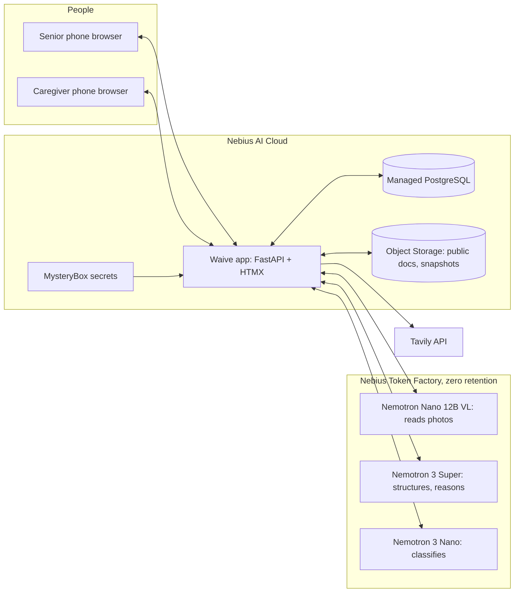

# Waive — design spec

Working title: **Waive**. Date: 2026-10-02. Status: direction approved in brainstorming; this spec is pending review.

## 1. Summary

Waive helps low-income seniors, and the family members who help them, get hospital bills forgiven or discounted under nonprofit hospitals' financial assistance policies (FAPs). A senior opens a link in their phone's browser, takes a photo of a hospital bill, and gets a plain-language answer ("You likely don't have to pay this"), a pre-filled application packet, and deadline reminders. A caregiver reviews everything before anything is sent.

Behind the app is a public **atlas**: one structured, cited, versioned *procedure sheet* per hospital that says who qualifies and exactly how to apply. Tavily scouts build and refresh the atlas from hospital websites. Patients' photos of paper documents and of the hospital's decision letters fill gaps and correct the atlas over time.

Everything runs on Nebius: NVIDIA Nemotron models on Nebius Token Factory (zero data retention) and the app, database and storage on Nebius AI Cloud. Running on a home computer is an optional mode for later.

## 2. Problem

- Nonprofit hospitals are 58% of US community hospitals (2,978 of about 5,100; AHA 2023 via KFF). IRS §501(r) requires each to have a written FAP, to cap charges for eligible patients, and to print a notice on every bill with the FAP phone number and web address (26 CFR 1.501(r)-4).
- Eligible patients are billed anyway. A 2019 KFF Health News analysis found 45% of nonprofit hospitals billed eligible patients (about $2.7B). Dollar For estimates at least $14B a year in charity care goes unclaimed.
- Rules differ by hospital (free care commonly up to 200% of the federal poverty level, discounts up to about 400%) and by state. Documents are scattered across web pages and per-facility PDFs.
- Seniors on fixed incomes often qualify, but they don't know the program exists, can't find or read the documents, struggle with forms and proofs, miss deadlines (240-day application window; no extraordinary collection actions before day 120), and are not comfortable with computers.

**Persona.** Rosa, 74, lives alone on $1,900 a month from Social Security ($22,800 a year, about 143% of the 2026 poverty guideline of $15,960 for one person). After an ER visit she receives a bill for $1,850. Her daughter Ana lives in another state and helps by phone.

**Problem statement.** Low-income seniors pay hospital bills they legally don't owe, because finding the rules and applying on time is too hard without computer skills.

### Prior art

- Dollar For (nonprofit) keeps the largest known database of hospital charity-care eligibility rules, built by hand and checked quarterly by software, and helps patients apply with human advocates (17,000+ applications, $60M+ relief since 2019). Waive should treat Dollar For as a partner and hand off complex cases.
- Hospital-side tools (Atlas Health, presumptive-eligibility vendors) work for hospitals, not patients.
- California (HCAI) and Washington (DOH) publish their hospitals' policies as documents, one state each.
- IRS Form 990 Schedule H reports each nonprofit hospital's income limits, one to two years late.
- Patient apps (Goodbill, ProjectLeo, Avelis, Counterforce, Claimable) run in the cloud and do not publish an open, cited dataset.

Waive's difference: procedure sheets (how to apply, not just who qualifies), open and cited data with versions, self-correction from real outcomes, zero-retention processing of personal data, and a phone flow built for people who do not use computers.

## 3. Goals and non-goals

### Goals (v1)

- **G1 — Photo to packet.** A senior goes from a bill photo to a caregiver-approved application packet without typing, in under 5 minutes of the senior's own effort.
- **G2 — Massachusetts atlas.** Published procedure sheets for Massachusetts nonprofit acute-care hospitals; every documented field backed by an exact quote from a dated source.
- **G3 — Self-correcting.** Every case's prediction is compared with the real outcome; per-hospital prediction accuracy is measured and drives re-checks.
- **G4 — Privacy.** Zero-retention inference for all personal data; photos deleted after reading; personal fields encrypted at rest; one-tap delete; contributions opt-in and de-identified.
- **G5 — Hackathon requirements.** Runtime calls to Nebius Token Factory; deployment on Nebius AI Cloud; NVIDIA Nemotron open models; functional runtime Tavily calls; public repo with license and README; demo video under 3 minutes.
- **G6 — Always-on scouting.** Scheduled Tavily refreshes within a credit budget.

### Non-goals (v1)

- Submitting applications electronically for the user (Waive prepares the packet; a person signs and sends it).
- Insurance denials and appeals, for-profit hospital negotiation, legal advice.
- Native mobile apps and SMS delivery (v1 sends links through the phone's own share sheet).
- National coverage (Phase 7) and home mode (optional Phase H).

## 4. Constraints and assumptions

- Solo builder working with Claude Code. Build day 2026-10-02 until 21:00 ET. Devpost deadline 2026-10-30 10:00 PT.
- Credits (from the original plan; confirm in Phase 0): Token Factory $100, AI Cloud $100, Tavily about 8,000 credits.
- Cloud accounts: the user's Token Factory project (API keys at https://tokenfactory.nebius.com/project/api-keys) and Nebius AI Cloud project, referenced as `NEBIUS_PROJECT_ID` in `.env` and never committed.
- US data residency is preferred for personal data; confirm the AI Cloud project region in Phase 0.
- Zero data retention (ZDR) must be enabled for the Token Factory scope before any personal data is processed. Nebius docs say ZDR is configured for the Token Factory scope and covers `/chat/completions` and `/completions`; the exact switch is to be confirmed (console or support).

## 5. Architecture

One deployable service (the app) with an in-process scheduler for scouting jobs. A CLI exposes the same pipelines for batch runs and operations.

### Units

| Unit | Responsibility | Depends on |
|---|---|---|
| `config` | Typed settings from env; secret loading; feature flags (`WAIVE_REQUIRE_ZDR`) | — |
| `ai` | Token Factory client: model registry, JSON-schema outputs with repair retry, timeouts, usage ledger, PHI flag | Token Factory |
| `rules` | Deterministic eligibility and deadline math; explanations with citations | `atlas.schema` |
| `atlas` | Registry seed, domain discovery, scouting, structuring, quote verification, validation, versioning, publishing, refresh | `ai`, Tavily, DB, Object Storage |
| `cases` | Case vault, bill extraction, hospital matching, household inputs, predictions, packets, reminders | `ai`, `rules`, `atlas` |
| `learning` | Photo classification, document contributions, gap requests, outcome capture, triage, aggregation, scoreboard | `ai`, `atlas`, `cases` |
| `governor` | Credit and spend budgets; scheduling priority | DB |
| `web` | Senior, caregiver, admin and public atlas pages | `cases`, `atlas`, `learning` |
| `cli` | `doctor`, `atlas …`, `demo …`, `cloud …` commands | all |

Each unit is a Python package with a small public API exported from its `__init__.py`. Units talk through those APIs and the database, never through each other's internals.

## 6. Technology

- Python 3.12 managed by `uv`; FastAPI + Uvicorn; Jinja2 templates with HTMX; Tailwind CSS via the standalone CLI (no Node toolchain).
- SQLAlchemy 2 with JSON columns for sheet bodies; SQLite for tests and local development (`var/waive.db`), PostgreSQL 16 (Nebius Managed PostgreSQL) in production, selected by `WAIVE_DATABASE_URL`. Tables are created with `create_all`; Alembic is added only when a schema change is needed after the first deployment.
- pydantic v2 + pydantic-settings; OpenAI Python SDK pointed at `https://api.tokenfactory.nebius.com/v1/` with `NEBIUS_API_KEY`; `tavily-python` with `TAVILY_API_KEY`.
- rapidfuzz (hospital matching), Pillow (image normalization, synthetic test images), WeasyPrint (PDF packets), pypdf (filling AcroForm forms), cryptography (AES-GCM field encryption), APScheduler (scheduled scouting), Typer (CLI).
- Tests: pytest, respx (HTTP mocking), hypothesis (property tests), Playwright (mobile E2E), axe-core via Playwright (accessibility), ruff (lint and format).
- Docker for packaging; Nebius CLI for deployment.

Rationale: one language and one service keep a solo, loop-driven build simple; server-rendered HTML keeps older phones fast and accessible.

## 7. Procedure sheet (atlas schema)

A procedure sheet is versioned per hospital. Every field is a `Field[T]`:

| Attribute | Meaning |
|---|---|
| `value` | The fact |
| `layer` | `documented` (from a hospital or state document) or `reported` (from patient outcomes) |
| `quote` | Exact text from the source (documented only) |
| `source_id` | The `SourceDoc` it came from |
| `checked_on` | Date the source was fetched or the evidence counted |
| `confidence` | 0–1 |
| `support_count` | Number of distinct cases (reported only) |

Sections:

- `hospital`: CMS certification number (CCN), name, system, address, city, state, ZIP, phone, ownership, website domain, EIN (optional).
- `eligibility`: `free_care_max_fpl` (percent), `discount_tiers` (list of min/max percent and discount), `asset_test`, `residency`, `insured_patients_covered`, `min_balance`, `services_excluded`.
- `programs`: `presumptive` (e.g. Medicaid, SNAP), `state_programs` (e.g. Massachusetts Health Safety Net and how to apply for it).
- `apply`: `form_url`, `form_version`, `documents_required` (enum list), `submit_methods` (mail address, fax, email, portal, in person), `window_days_from_first_bill` (240 unless the policy is more generous), `decision_days` (documented) and `decision_days_reported` (median).
- `collections`: `eca_wait_days` (at least 120), `collection_agencies`.
- `contacts`: phone, hours, languages.
- `coverage`: facilities covered, provider list URL.
- `meta`: version, status (`draft`, `published`, `held`), completeness (0–1), accuracy (rolling), sources.

Document types (`DocType`): `photo_id`, `proof_of_income`, `social_security_letter`, `tax_return`, `pay_stubs`, `bank_statements`, `proof_of_residency`, `insurance_card`, `medicaid_denial`, `other`.

## 8. Atlas pipeline

1. **Seed.** Load the CMS Hospital General Information dataset (Medicare-certified hospitals with ownership). Keep hospitals whose type is "Acute Care Hospitals" or "Critical Access Hospitals" and whose ownership is nonprofit ("Voluntary non-profit – Private / Church / Other"). Store a dated snapshot.
2. **Discover the official domain.** Tavily Search for the hospital's site; reject directories (Wikipedia, Healthgrades, US News, Yelp and similar); confirm by matching name and phone on the homepage via Tavily Extract.
3. **Scout documents.** Tavily Search restricted to that domain (plus Tavily Map when needed) for the FAP, plain-language summary, application form, and billing and collections policy. Tavily Extract fetches PDF and HTML text. Store text, SHA-256 and fetch time in Object Storage. A system-wide document is shared by all of its member hospitals.
4. **Structure.** Nemotron 3 Super turns the documents into a `ProcedureSheet` draft (JSON schema), with an exact quote for each documented field.
5. **Verify quotes.** Normalize text (case, whitespace, quote and dash characters, line-break hyphenation). Accept a field only if its quote is a substring of the cited source and, for numbers, the value appears in the quote. Critical fields (income limits, tiers, application window, presumptive programs) also need two independent extractions to agree (Nemotron 3 Super and Nemotron 3 Nano, or two prompts); disagreement opens a review item.
6. **Validate.** Schema checks; cross-checks against state minimums and, when available, IRS Schedule H limits; completeness score; facility coverage check.
7. **Publish.** A new version whenever any field changes; the diff is stored; open cases at that hospital are re-evaluated.
8. **Refresh.** Re-check documents by content hash on a schedule. Priority = staleness × case demand × (1 − accuracy). An unknown hospital on a bill triggers on-demand scouting using the FAP web address printed on the bill.

## 9. Bill reading and case flow

1. **Photo intake (camera only).** The phone resizes the image; the server fixes orientation, strips metadata and checks quality (size, blur). The photo lives only in memory, or as an encrypted temporary object with a 1-hour lifetime for asynchronous processing.
2. **Extraction.** Nemotron VL returns `BillExtract`: hospital name, address and phone; the FAP notice web address and phone; statement date and whether it is the first statement; account reference; patient name (encrypted, only kept for the packet); amount due; insurance payments; provider entity; collection-agency notice and its date.
3. **Read-back.** The senior confirms hospital, amount and date with large Yes/Fix buttons; the caregiver can correct any field.
4. **Matching.** rapidfuzz on name, city or ZIP, phone and notice domain against the registry. Low confidence shows the caregiver the top 3 choices.
5. **Household inputs.** Household size by large buttons; income from a photo of the Social Security benefit letter (Nemotron VL) or entered by the caregiver.
6. **Eligibility.** `rules.evaluate(sheet, household, bill, today)` returns a tier (`free`, `discount`, `not_eligible`, `needs_info`, `unknown`), percent of poverty level, reasons with citations, missing inputs and deadlines.
7. **Prediction.** Saved when the result is first shown (sheet version, income band, predicted tier, expected documents).
8. **Packet.** Cover letter citing the policy section, completed application data sheet, document checklist, mailing or fax instructions and a link to the hospital's own form. Filling the hospital's own PDF form when it has form fields is a stretch goal.
9. **Approval.** The caregiver must approve before the packet is marked ready. People print, sign and send it.
10. **Reminders.** Check-ins on days 14, 30 and 45 after sending; alerts before day 120 (collections protection) and day 240 (end of the application window). v1 delivers them in the app and as calendar (`.ics`) files.

## 10. Learning loop

- **Photo classifier.** Classes: bill, explanation of benefits, decision letter, information request, plain-language summary, FAP, application form, Social Security letter, other.
- **Public document contributions.** Only for policy, summary and blank-form classes. An automated personal-information check (vision model plus patterns for names, account numbers, dates of birth and addresses) runs first; v1 also holds each contribution for admin review. Approved documents become sources with `source = patient_photo`.
- **Gap requests.** When a hospital's sheet is incomplete or a critical field has low confidence, the app asks one targeted, skippable question per case, for example "Did the hospital give you any papers about financial help? Take a photo."
- **Outcome capture.** Decision and request letters become `OutcomeExtract`: decision, discount percent, reasons, documents requested, decision date.
- **Compare and triage.** Deterministic rules first, model-assisted classification of free-text reasons second, admin confirmation in v1:
  - `case_issue` — incomplete, late, unsigned, or income higher than entered. Help the person resubmit; no atlas change.
  - `sheet_missing` — a document or step the sheet doesn't list. Record reported evidence; it is published as "reported by patients" after 5 distinct cases.
  - `sheet_wrong` or `hospital_slip` — a denial that contradicts the sheet. Re-scout immediately. If the fresh document differs, it is `sheet_wrong` and a new version is published after review. If it matches, it is `hospital_slip`: draft an appeal citing the section and raise an accountability flag (internal after 3 cases, public after 5).
- **Scoreboard.** Per hospital, rolling accuracy = matched outcomes ÷ outcomes. Sheets with at least 3 outcomes and accuracy below 0.8 get priority re-checks.
- **Contribution format.** Fixed enums only (no free text), income bands instead of amounts, no identifiers.

## 11. Privacy and security

- Token Factory ZDR is enabled for the scope. `WAIVE_REQUIRE_ZDR=true` blocks any call marked as carrying personal data until an operator sets `WAIVE_ZDR_CONFIRMED=true` after confirming ZDR.
- Personal fields are encrypted with AES-GCM; the key comes from MysteryBox in the cloud and from `.env` in development.
- Photos are never written to disk unencrypted and are deleted after extraction.
- Logs and the usage ledger never store personal content.
- Access uses signed, expiring, revocable capability links with separate scopes for the senior (upload, view result) and the caregiver (review, approve, delete). Requests are rate-limited.
- One-tap delete removes the case and all personal data derived from it. De-identified contributions remain.
- Web content and document text are treated as data, never instructions. The structurer has no tools, its output is schema-validated, and quote verification rejects invented values.
- The app never asks for payment, card numbers or bank logins, and tells seniors so.
- Results are estimates, not legal advice; the hospital decides.

## 12. Risks and mitigations

| Risk | Mitigation | Verified by |
|---|---|---|
| Wrong or outdated document | Official domain only; effective-date and facility checks; refresh by content hash | Atlas tests; manual spot check |
| Model invents a field value | Exact-quote verification; dual extraction for critical fields | Unit and contract tests |
| Bill misread | Read-back confirmation; caregiver correction | Synthetic corpus accuracy; E2E tests |
| Wrong eligibility math | Deterministic engine with the official poverty table | Property tests |
| Overpromising | "Likely" wording; citations; hospital decides | Template tests |
| Missed deadlines | Day-120 and day-240 tracking; reminders | Unit tests |
| Personal data leak | ZDR; encryption; no personal data in logs; capability links | Security tests; log scanner |
| Fake or poisoned reports | Enums only; 5-case threshold; outlier hold; reports never overwrite documents | Simulation tests |
| Prompt injection from web pages | No tools in the structurer; schema validation; quote check | Adversarial fixtures |
| Cost overrun | Credit governor with hard caps; spend ledger | Governor tests |
| Hospital not nonprofit | Ownership check; guidance on other options | Unit tests |

## 13. Testing strategy

- **Unit (TDD):** rules, schema, quote verification, matching, governor, triage, aggregation.
- **Contract:** Token Factory and Tavily calls against recorded responses (respx). A small live smoke suite runs only with `-m live` and respects the budget guard.
- **Synthetic corpus:** 30+ generated bill images (layouts, fonts, rotation, blur), plus decision letters and policy pages, each with ground-truth JSON; an accuracy report per field.
- **Atlas evaluation:** a manual spot check of 10 hospitals by the user, scored per field.
- **Simulation:** synthetic outcomes drive triage, mocked re-scouts, version bumps and the 5-case thresholds.
- **E2E:** Playwright with mobile viewports (iPhone 13, Pixel 7) for the senior and caregiver flows; axe-core accessibility checks.

## 14. Deployment on Nebius AI Cloud

- Docker image pushed to Nebius Container Registry.
- The app runs on a Serverless AI endpoint (CPU platform, smallest preset, container port 8000). No endpoint auth because it is a public web app; the app enforces its own capability links. Env vars via `--env`, secrets via `--env-secret` from MysteryBox. The endpoint gets a managed HTTPS URL. Fallback: one small Compute VM with Docker and Caddy.
- Managed PostgreSQL (smallest preset). An Object Storage bucket holds public documents and atlas snapshots.
- Endpoints bill while running (no scale to zero), so they run during build and demo windows. `waive cloud stop` and `waive cloud start` wrap the CLI.
- A cleanup command lists and deletes only resources named with the `waive-` prefix and asks before deleting.

## 15. Cost estimates (confirm against current pricing before provisioning)

- **Tavily:** Massachusetts build about 100 hospitals × 2–3 credits ≈ 300 credits; national first pass ≈ 4,800–6,600 credits; refreshes extract only documents whose hash changed.
- **Token Factory:** structuring ≈ $0.006 per hospital with Nemotron 3 Super (about 15K input and 1.5K output tokens at $0.30 / $0.90 per million); bill reading priced by the vision model's token rate (to confirm).
- **AI Cloud:** CPU endpoint ≈ $0.07–0.13 per hour while running; PostgreSQL price to confirm; Object Storage negligible at this scale.
- **Development caps** (enforced by the governor; raising them needs the user's approval): Tavily 1,000 credits, Token Factory $15, AI Cloud $30 until Phase 7.

## 16. Metrics

- **Product:** time to packet, read-back correction rate, prediction accuracy, dollars of bills addressed (synthetic in the demo).
- **Atlas:** hospitals covered, share of fields documented with verified quotes, median sheet age, per-hospital accuracy, review queue size.
- **Cost:** credits per day, dollars per case.

## 17. Phases

0 Foundations and connectivity → 1 Domain core → 2 Massachusetts atlas → 3 Bill reading and cases → 4 Phone web app and packet → 5 Learning loop → 6 Deploy on Nebius → 7 Always-on scouting and national scale → 8 Submission. Optional H: home mode. Goals, exit criteria and user gates per phase are in `docs/superpowers/plans/2026-10-02-waive-master-plan.md`.

## 18. Open items to verify

Tracked in `docs/PROGRESS.md`:

- How ZDR is switched on for the Token Factory scope (console setting or support request).
- Exact Token Factory model IDs; the vision model's image input format and structured-output support; vision model pricing.
- AI Cloud project region; smallest CPU endpoint preset; smallest Managed PostgreSQL preset and price.
- The 2026 poverty guideline table, including the per-person increment (Federal Register 2026-00755).
- Massachusetts Health Safety Net eligibility and how Massachusetts hospital FAPs route applications (MassHealth application).
- 501(r) details beyond days 120 and 240 (for example the 30-day notice before collection actions) to encode as warnings.
- Licenses: Apache-2.0 for code and CC BY 4.0 for atlas data (defaults; the user may change them).
